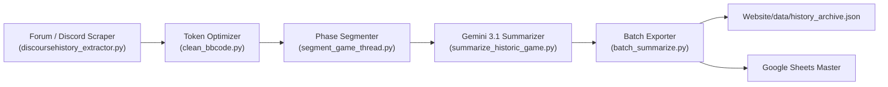

# Mafia History Project Subsystem Overview

The `/Other Projects/Mafia History Project` directory contains the complete pipeline for extracting historical Mafia games from Discourse forums and Discord channels, cleaning BBCode markup, extracting phase lynches/kills, generating AI narrative summaries using Google Gemini, and exporting to Google Sheets and the website.

## 🧭 Navigation
- **Parent Hub**: [[Other_Projects_Overview]]
- **Connected Systems**: [[Website_Portal_Overview]], [[Website_Data_Overview]], [[History_Project_Docs_Overview]]
- **Requirements Reference**: [[History_Project_Docs_Overview]], [[HISTORIC_PROJECT_PLAN]], [[docs/history_project/HIGH_LEVEL_REQUIREMENTS|History Project HLR]], [[docs/history_project/DETAILED_REQUIREMENTS|History Project DLR]]

---

## 📄 Pipeline Modules

| File | Pipeline Role | Key Functions / Responsibilities |
| :--- | :--- | :--- |
| `discoursehistory_extractor.py` | Forum Scraper | Connects to Discourse forum API, fetches topic posts, handles pagination, and extracts raw JSON threads. |
| `discordhistory_extractor.py` | Discord Scraper | Extracts message histories from Discord game channels and exports structured post archives. |
| `forumhistory_extractor.py` | Generic Parser | Fallback parser for standard forum formats. |
| `clean_bbcode.py` | Token Optimizer | Strips quotes, formatting noise, and BBCode tags to reduce LLM token count by up to 70%. |
| `segment_game_thread.py` | Thread Segmenter | Detects Moderator posts, phase boundaries (Day/Night), lynch vote counts, and player deaths. |
| `summarize_historic_game.py` | AI Storyteller | Formulates prompts for Gemini 3.1 Flash-Lite / Pro, infers game outcomes if missing, and creates rich game chronicles. |
| `batch_summarize.py` | Batch Exporter | Automates end-to-end processing across games and exports `Website/data/history_archive.json`. |
| `user_mapper_exporter.py` | User Resolution | Maps forum handles to Discord IDs and syncs master user registries to Google Sheets. |
| `update_source_types.py` | Metadata Manager | Classifies historical sources into Classic, Forum, or Discord categories. |
| `historybot_config.py` | Configuration | Manages API keys (`GOOGLE_AI_API_KEY_HISTORIC_PROJECT`), forum endpoints, and rate limits. |

---

## 🔄 Historical Processing Pipeline

---

## 🔗 Connected Overviews
- [[Other_Projects_Overview]]: Return to Other Projects Index
- [[Website_Portal_Overview]]: Web portal displaying these historic game recaps
- [[History_Project_Docs_Overview]]: Detailed specifications and engineering requirements
