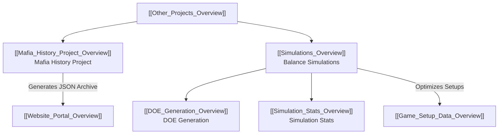

# Other Projects Hub Overview

The `/Other Projects` directory houses specialized research initiatives, historical archiving pipelines, and game balance simulation tools supporting the IC Mafia Bot ecosystem.

## 🧭 Navigation
- **Parent Hub**: [[Root_Project_Overview]]
- **Sub-Projects**:
  - [[Mafia_History_Project_Overview]] (`/Other Projects/Mafia History Project/`)
  - [[Simulations_Overview]] (`/Other Projects/Simulations/`)
- **Connected Systems**: [[Website_Portal_Overview]], [[Game_System_Overview]]

---

## 🏗️ Sub-Projects Architecture

---

## 📄 Sub-Projects Summary

| Project | Directory | Overview Document | Core Objective |
| :--- | :--- | :--- | :--- |
| **Mafia History Project** | `Mafia History Project/` | [[Mafia_History_Project_Overview]] | Scrapes, parses, and AI-summarizes hundreds of historical forum and Discord games for preservation and website viewing. |
| **Balance Simulations** | `Simulations/` | [[Simulations_Overview]] | Runs headless Monte Carlo simulations to balance game roles, faction win probabilities, and Design of Experiments (DOE) scenarios. |

---

## 🔗 Connected Overviews
- [[Root_Project_Overview]]: Return to Master Hub
- [[Mafia_History_Project_Overview]]: Historical thread extractors and LLM summarizer
- [[Simulations_Overview]]: Monte Carlo simulation engine
