# IC Mafia Bot Ecosystem — Root Project Hub

Welcome to the **IC Mafia Bot** ecosystem knowledge graph. This root document serves as the master Map of Content (MOC) connecting all architecture layers, game engines, Discord command cogs, community systems, external websites, simulations, historical archives, and documentation.

## 🗺️ Master System Map

```mermaid
flowchart TD
    Root["[[Root_Project_Overview]]"]
    
    subgraph CoreBot["Discord Bot Subsystems"]
        Setup["[[Bot_Setup_Overview]]"]
        Cogs["[[Cogs_Overview]]"]
        Game["[[Game_System_Overview]]"]
        Comm["[[Community_System_Overview]]"]
        Utils["[[Utilities_Overview]]"]
        Data["[[Data_Assets_Overview]]"]
        Logs["[[Logs_Directory_Overview]]"]
        StatsStore["[[Stats_Storage_Overview]]"]
        Tests["[[Tests_Overview]]"]
    end
    
    subgraph WebAndHistory["Portals and Research"]
        Web["[[Website_Portal_Overview]]"]
        Other["[[Other_Projects_Overview]]"]
        History["[[Mafia_History_Project_Overview]]"]
        Sims["[[Simulations_Overview]]"]
    end

    subgraph Docs["Project Documentation"]
        DocsHub["[[Documentation_Hub_Overview]]"]
        MafiaDocs["[[Mafia_Bot_Docs_Overview]]"]
        WebDocs["[[Website_Docs_Overview]]"]
        HistDocs["[[History_Project_Docs_Overview]]"]
    end

    Root --> Setup
    Root --> Cogs
    Root --> Game
    Root --> Comm
    Root --> Utils
    Root --> Data
    Root --> Logs
    Root --> StatsStore
    Root --> Tests
    
    Root --> Web
    Root --> Other
    Other --> History
    Other --> Sims
    
    Root --> DocsHub
    DocsHub --> MafiaDocs
    DocsHub --> WebDocs
    DocsHub --> HistDocs
```

---

## 📂 Subsystem Quick Directory

| Subsystem | Directory | Overview Document | Description |
| :--- | :--- | :--- | :--- |
| **Bot Startup & Lifecycle** | `/setup` | [[Bot_Setup_Overview]] | Bot bootstrap, logging setup, and dynamic cog registration. |
| **Command Cogs** | `/cogs` | [[Cogs_Overview]] | Discord slash command handlers grouped by functional domains. |
| **Core Game System** | `/game` | [[Game_System_Overview]] | Player state models, dynamic setups, night actions, and state machine loop. |
| **Community System** | `/community` | [[Community_System_Overview]] | Player quirks submission, admin approval flow, and custom UI views. |
| **Shared Utilities** | `/utils` | [[Utilities_Overview]] | Helper functions for JSON I/O, Discord message chunking, role sync, and DM dispatch. |
| **Configuration Templates** | `/templates` | [[Templates_Overview]] | Template configurations (`.env.template`, `config_template.py`) and coverage scripts. |
| **Data Assets** | `/data` | [[Data_Assets_Overview]] | Role definitions, game setups, themes, in-jokes, and Discord role mappings. |
| **Test Suite** | `/tests` | [[Tests_Overview]] | Comprehensive `pytest` test suite covering all modules, engine loops, and full QA. |
| **Game Stats Storage** | `/stats` | [[Stats_Storage_Overview]] | Historic game records, JSON stats, story archives across Alpha, Beta, and Production. |
| **Execution Logs** | `/logs` | [[Logs_Directory_Overview]] | Bot runtime logs, Discord debug traces, and Gemini prompt archives. |
| **Web Analytics Portal** | `/Website` | [[Website_Portal_Overview]] | Web frontend for viewing game trends, leaderboards, and historical summaries. |
| **Other Projects** | `/Other Projects` | [[Other_Projects_Overview]] | Mafia History Project (forum scrapers & AI summarizer) and balance simulations. |
| **Documentation Hub** | `/docs` | [[Documentation_Hub_Overview]] | High-Level & Detailed Requirements for the Bot, Website, and History Project. |

---

## 🔗 Key Documentation Links
- **Bot Requirements**: [[Mafia_Bot_Docs_Overview]] | [[HIGH_LEVEL_REQUIREMENTS]] | [[DETAILED_REQUIREMENTS]]
- **Website Requirements**: [[Website_Docs_Overview]] | [[WEBSITE_PORTAL_PLAN]]
- **History Project Requirements**: [[History_Project_Docs_Overview]] | [[HISTORIC_PROJECT_PLAN]]
