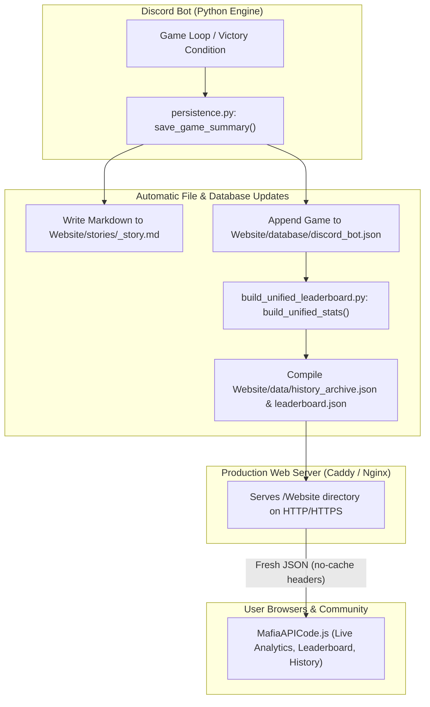

# Production Deployment & Hosting Guide

This guide provides end-to-end instructions for deploying the **IC Mafia Bot** and its **Website Analytics Portal** in production, ensuring that finished games automatically update the website, leaderboards, and historical records in real-time.

---

## 🏗️ Architecture: How Live Games Update the Website



### The Automation Sequence
1. **Match Concludes**: When a game reaches its victory condition (`win.py`), `persistence.py:save_game_summary()` is triggered.
2. **Markdown Generation**: It creates `{game_id}_summary.md` and `{game_id}_story.md` in `Website/stories/`.
3. **Database Append**: The complete box score (roster, timeline, vote tally, duration) is written into `Website/database/discord_bot.json`.
4. **Data Recompilation**: The engine automatically calls `Website.build_unified_leaderboard.build_unified_stats(False)`. This recalculates all career ratings and rewrites `Website/data/history_archive.json` and `Website/data/leaderboard.json`.
5. **Instant Delivery**: Because the web server serves the `Website/` folder directly from the same filesystem, the updated stats and stories are live immediately without manual intervention.

---

## 🚀 Recommended Deployment: Oracle Cloud Always Free VM

Oracle Cloud Infrastructure (OCI) offers an **Always Free Tier** with an **Ampere A1 Compute instance** (up to 4 OCPUs and 24 GB RAM) or standard AMD micro instances, which is ideal for running both the Discord bot and the web server together 24/7.

### Step 1: Provision the VM
1. Sign up / log into [Oracle Cloud Console](https://cloud.oracle.com/).
2. Create a Compute Instance:
   - **Image**: Ubuntu 22.04 LTS or Ubuntu 24.04 LTS.
   - **Shape**: `VM.Standard.A1.Flex` (e.g. 2 OCPU, 12GB RAM) or `VM.Standard.E2.1.Micro`.
   - **SSH Keys**: Download your private key and add your public key.
3. Assign a **Reserved Public IPv4** address under **Compute > Instances > Instance Details > Attached VNICs**.

### Step 2: Open Ingress Firewall Ports
By default, Oracle Cloud blocks web ports. You must open ports **80** (HTTP) and **443** (HTTPS):
1. In Oracle Console: Go to **Virtual Cloud Networks > Your VCN > Security Lists > Default Security List**.
2. Click **Add Ingress Rules**:
   - **Source CIDR**: `0.0.0.0/0`
   - **IP Protocol**: TCP
   - **Destination Port Range**: `80,443`
3. In the VM terminal (Ubuntu `iptables` / `ufw`), allow traffic:
   ```bash
   sudo iptables -I INPUT 6 -m state --state NEW -p tcp --dport 80 -j ACCEPT
   sudo iptables -I INPUT 6 -m state --state NEW -p tcp --dport 443 -j ACCEPT
   sudo netfilter-persistent save
   ```

---

## 📦 Step 3: Clone Repository & Setup Python Environment

SSH into your Oracle VM:
```bash
ssh -i /path/to/private_key.key ubuntu@<YOUR_VM_PUBLIC_IP>
```

Update system packages and install prerequisites:
```bash
sudo apt update && sudo apt upgrade -y
sudo apt install -y python3 python3-pip python3-venv git curl ufw
```

Clone the repository to `/home/ubuntu/ic-mafia-bot`:
```bash
git clone <YOUR_GIT_REPO_URL> /home/ubuntu/ic-mafia-bot
cd /home/ubuntu/ic-mafia-bot
```

Create and activate virtual environment:
```bash
python3 -m venv .venv
source .venv/bin/activate
pip install --upgrade pip
pip install -r requirements.txt
```

Create production configuration (`.env`):
```bash
nano .env
```
Ensure your `.env` contains your production credentials:
```ini
DISCORD_TOKEN=your_production_bot_token_here
BOT_PREFIX=!
ENVIRONMENT=production
DATA_SAVE_PATH=stats/Production
RULES_AND_ROLES_CHANNEL_ID=123456789012345678
GOOGLE_SHEET_KEY=your_google_sheet_id
GOOGLE_SERVICE_ACCOUNT_JSON=service_account.json
```

Compile initial website data:
```bash
python3 Website/build_unified_leaderboard.py
```
*(Verify output confirms loaded games and successful export to `Website/data/`)*.

---

## 🌐 Step 4: Configure Web Server (Caddy - Recommended)

[Caddy](https://caddyserver.com/) is the easiest modern web server because it provides **automatic SSL (Let's Encrypt)**, reverse proxying, and simple cache control.

### Install Caddy
```bash
sudo apt install -y debian-keyring debian-archive-keyring apt-transport-https curl
curl -1sLf 'https://dl.cloudsmith.io/public/caddy/stable/gpg.key' | sudo gpg --dearmor -o /usr/share/keyrings/caddy-stable-archive-keyring.gpg
curl -1sLf 'https://dl.cloudsmith.io/public/caddy/stable/debian.deb.txt' | sudo tee /etc/apt/sources.list.d/caddy-stable.list
sudo apt update
sudo apt install caddy -y
```

### Configure `/etc/caddy/Caddyfile`
Edit the Caddyfile:
```bash
sudo nano /etc/caddy/Caddyfile
```
Replace the content with the configuration below (replace `mafia.yourdomain.com` with your domain, or use `:80` if using IP only):

```caddy
mafia.yourdomain.com {
    root * /home/ubuntu/ic-mafia-bot/Website
    file_server

    # Crucial: Prevent browser caching of dynamic JSON and stories
    # This guarantees visitors see fresh match results as soon as games conclude
    @dynamic {
        path /data/*.json
        path /stories/*.md
        path /database/*.json
    }
    header @dynamic Cache-Control "no-cache, must-revalidate, max-age=0"

    # Static assets can be cached
    @static {
        path /css/*
        path /js/*
        path *.png
        path *.jpg
    }
    header @static Cache-Control "public, max-age=86400"

    encode gzip zstd
}
```

Restart Caddy:
```bash
sudo systemctl restart caddy
sudo systemctl enable caddy
```

---

## 🛡️ Alternative: Nginx Configuration

If you prefer Nginx:
```bash
sudo apt install nginx -y
sudo nano /etc/nginx/sites-available/mafia-website
```

Configuration:
```nginx
server {
    listen 80;
    server_name mafia.yourdomain.com;
    root /home/ubuntu/ic-mafia-bot/Website;
    index index.html;

    location / {
        try_files $uri $uri/ =404;
    }

    # Disable caching for dynamic data JSONs and markdown stories
    location ~* \.(json|md)$ {
        add_header Cache-Control "no-cache, must-revalidate, max-age=0";
        try_files $uri =404;
    }

    location ~* \.(css|js|png|jpg|jpeg|gif|ico|svg)$ {
        expires 7d;
        add_header Cache-Control "public, no-transform";
    }
}
```

Enable site and reload:
```bash
sudo ln -s /etc/nginx/sites-available/mafia-website /etc/nginx/sites-enabled/
sudo nginx -t
sudo systemctl reload nginx
```
*(Optionally run `sudo certbot --nginx` to obtain free SSL certificates).*

---

## 🤖 Step 5: Configure Bot as a Systemd Background Service

To keep the Discord bot running continuously across reboots:

Create service file:
```bash
sudo nano /etc/systemd/system/ic-mafia-bot.service
```

Paste the following service definition:
```ini
[Unit]
Description=IC Mafia Discord Bot
After=network.target

[Service]
Type=simple
User=ubuntu
WorkingDirectory=/home/ubuntu/ic-mafia-bot
ExecStart=/home/ubuntu/ic-mafia-bot/.venv/bin/python main.py
Restart=always
RestartSec=10
EnvironmentFile=/home/ubuntu/ic-mafia-bot/.env
StandardOutput=append:/home/ubuntu/ic-mafia-bot/logs/bot_stdout.log
StandardError=append:/home/ubuntu/ic-mafia-bot/logs/bot_stderr.log

[Install]
WantedBy=multi-user.target
```

Enable and start the service:
```bash
sudo systemctl daemon-reload
sudo systemctl enable ic-mafia-bot
sudo systemctl start ic-mafia-bot
```

Check bot status and logs:
```bash
sudo systemctl status ic-mafia-bot
tail -f /home/ubuntu/ic-mafia-bot/logs/bot_stdout.log
```

---

## ☁️ Step 6: Alternative Hosting - Cloudflare Tunnel (Zero Port Forwarding)

If you do not want to open public firewall ports on the Oracle VM:
1. Install `cloudflared` on the Oracle VM:
   ```bash
   curl -L --output cloudflared.deb https://github.com/cloudflare/cloudflared/releases/latest/download/cloudflared-linux-amd64.deb
   sudo dpkg -i cloudflared.deb
   ```
2. Log into Cloudflare:
   ```bash
   cloudflared tunnel login
   ```
3. Create a tunnel:
   ```bash
   cloudflared tunnel create mafia-portal
   ```
4. Point the tunnel to local port 80 (served by Caddy/Nginx) or directly serve the directory:
   ```yaml
   tunnel: <TUNNEL_ID>
   credentials-file: /home/ubuntu/.cloudflared/<TUNNEL_ID>.json

   ingress:
     - hostname: mafia.yourdomain.com
       service: http://localhost:80
     - service: http_status:404
   ```
5. Run the tunnel service:
   ```bash
   sudo cloudflared service install
   sudo systemctl start cloudflared
   ```
This provides free Cloudflare DDoS protection, automatic CDN caching rules, and SSL without exposing any public VM IP.

---

## 📊 Google Sheets Sync Integration

The bot includes native integration with Google Sheets:
- When a game finishes, `export_game_stats(game)` calls `ExportCog.run_export_logic()`.
- It executes `scripts/sync_google_sheets.py:sync_all_to_sheets()`.
- Synchronizes all 4 historical eras (`Classic Forum`, `Discourse`, `Discord Manual`, `Discord Bot`) to their respective Google Sheets tabs, updates player leaderboards, and logs setup configurations to the `Rules Setup` tab.
- If you ever need to manually push to Google Sheets, use `/exportstats` in Discord or run:
  ```bash
  python3 scripts/sync_google_sheets.py
  ```

---

## 🛠️ Verification & Maintenance Checklist

| Task | Command | Expected Result |
| :--- | :--- | :--- |
| **Test Unified Rebuild** | `python3 Website/build_unified_leaderboard.py` | Generates `Website/data/history_archive.json` & `leaderboard.json` with 200+ games and 300+ players. |
| **Check Bot Process** | `sudo systemctl status ic-mafia-bot` | Status: `active (running)`. |
| **Check Web Server** | `sudo systemctl status caddy` | Status: `active (running)`. |
| **View Live Bot Logs** | `journalctl -u ic-mafia-bot -f` | Shows real-time Discord events and game state transitions. |
| **Update Player Aliases** | Edit `Website/data/master_user_map.json` and `build_unified_leaderboard.py:CANONICAL_NAMES` | Run `python3 Website/build_unified_leaderboard.py` to compile changes. |
| **Hard Refresh Browser** | Press `Ctrl + F5` or `Cmd + Shift + R` | Reloads website assets bypassing local browser cache. |
