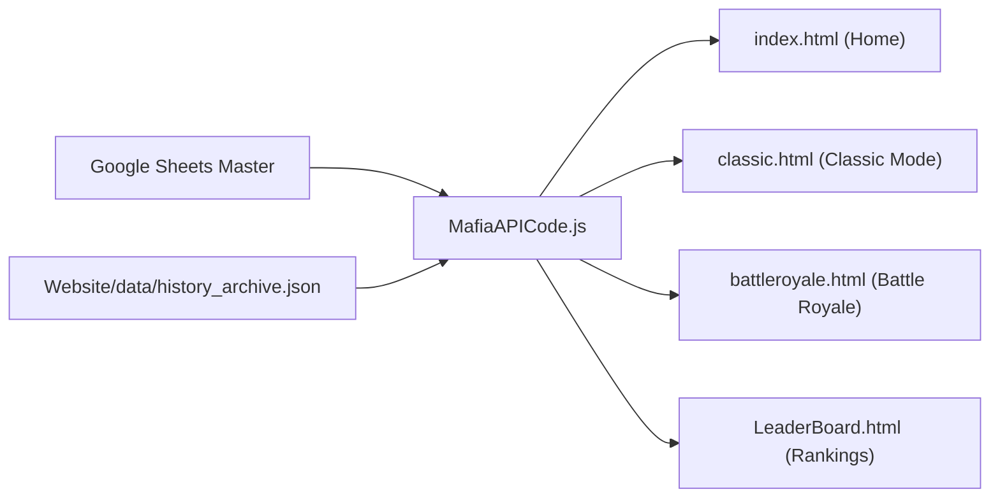

# Website Analytics Portal Overview

The `/Website` directory contains the modern web dashboard interface for players and community members to explore overall match trends, faction balance, leaderboards, and historical game summaries.

## 🧭 Navigation
- **Parent Hub**: [[Root_Project_Overview]]
- **Sub-Directories**: [[Website_Data_Overview]] (`/Website/data/`)
- **Connected Systems**: [[Mafia_History_Project_Overview]], [[Stats_Storage_Overview]], [[Export_Cogs_Overview]]
- **Requirements Reference**: [[Website_Docs_Overview]], [[WEBSITE_PORTAL_PLAN]], [[docs/website/HIGH_LEVEL_REQUIREMENTS|Website HLR]], [[docs/website/DETAILED_REQUIREMENTS|Website DLR]]

---

## 📄 File Index

| File | Type | Purpose | Key Integrations |
| :--- | :--- | :--- | :--- |
| `index.html` | Web Page | Portal Landing Page providing navigation across all analytics sections and bot documentation. | Global navigation bar, quick metrics. |
| `classic.html` | Web Page | Analytics dashboard for Classic Mafia game modes (win rates, faction balance, average duration). | Chart.js, Google Sheets API. |
| `battleroyale.html` | Web Page | Analytics dashboard for Battle Royale game modes (survival times, kill tallies, weapon stats). | Chart.js, Google Sheets API. |
| `LeaderBoard.html` | Web Page | Player rankings, career skill scores, win counts, and Hall of Fame records. | Live table search, sorting, and pagination. |
| `MafiaAPICode.js` | JavaScript | Client-side data fetching, Google Sheets API connector, JSON parsers, and interactive Chart.js graphs. | Connects to Google Sheets & `/Website/data`. |

---

## 📊 Data Flow Architecture

---

## 🔗 Connected Overviews
- [[Root_Project_Overview]]: Return to Master Hub
- [[Website_Data_Overview]]: Historical archive data feeding the website
- [[Mafia_History_Project_Overview]]: The history project that extracts and summarizes games for the portal
- [[Website_Docs_Overview]]: Full requirements and development plans
