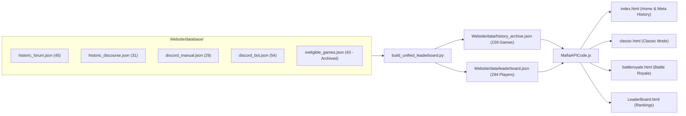

# Website Analytics Portal Overview

The `/Website` directory contains the modern web dashboard interface for players and community members to explore overall match trends, faction balance, leaderboards, and historical game summaries.

## 🧭 Navigation
- **Parent Hub**: [[Root_Project_Overview]]
- **Sub-Directories**: [[Website_Data_Overview]] (`/Website/data/`), `/Website/database/` (Modular source databases), `/Website/stories/` (Markdown narratives)
- **Connected Systems**: [[Mafia_History_Project_Overview]], [[Stats_Storage_Overview]], [[Export_Cogs_Overview]]
- **Requirements Reference**: [[Website_Docs_Overview]], [[WEBSITE_PORTAL_PLAN]], [[docs/website/HIGH_LEVEL_REQUIREMENTS|Website HLR]], [[docs/website/DETAILED_REQUIREMENTS|Website DLR]]

---

## 📄 File Index

| File | Type | Purpose | Key Integrations |
| :--- | :--- | :--- | :--- |
| `index.html` | Web Page | Portal Landing Page providing navigation across all analytics sections, meta-history charts with era dividers, and bot documentation. | Global navigation bar, quick metrics, multi-era timeline. |
| `classic.html` | Web Page | Analytics dashboard for Classic Mafia game modes (win rates, faction balance, average duration). | Chart.js, multi-era datasets. |
| `battleroyale.html` | Web Page | Analytics dashboard for Battle Royale game modes (survival times, kill tallies, weapon stats). | Chart.js, multi-era datasets. |
| `LeaderBoard.html` | Web Page | Player rankings, career skill scores, win counts, and Hall of Fame records across 341 unified players. | Live table search, sorting, and pagination. |
| `MafiaAPICode.js` | JavaScript | Client-side data fetching, JSON parsers, era dividers, and interactive Chart.js graphs. | Connects to `/Website/data/history_archive.json` & `/Website/data/classic.json`. |
| `build_unified_leaderboard.py` | Python Script | Compiles modular JSON databases into unified `history_archive.json` and `leaderboard.json`. | Multi-era unification pipeline. |
| `PRODUCTION_SETUP_GUIDE.md` | Guide | Complete operational guide for hosting the site on Oracle Cloud VM, Nginx/Caddy, or Google Cloud. | Production deployment instructions. |
| `Production_Build_Overview.md` | Overview | Overview of production build architecture and real-time game-to-website persistence pipeline. | Automated game update pipeline. |

---

## 🏛️ Multi-Era Historical Database Architecture

The website aggregates **159 eligible started games** and **294 players** across 4 distinct community eras:
- **Classic Forum Era** (`Website/database/historic_forum.json`): 45 games (2008–2017).
- **Discourse Era** (`Website/database/historic_discourse.json`): 31 games (2019–2020).
- **Discord Manual Era** (`Website/database/discord_manual.json`): 29 games (2022–2026).
- **Discord Bot Era** (`Website/database/discord_bot.json`): 54 games (2024–Present).

Additionally, **43 unstarted / ineligible games** (ghost threads, unstarted sign-ups, discussion topics) are excluded from competitive ratings and archived in `Website/database/ineligible_games.json`, with their narratives safely preserved in `Website/stories/ineligible games/`.

Stories and phase-by-phase updates are preserved in markdown under `/Website/stories/`.

---

## 📊 Data Flow Architecture

---

## 🔗 Connected Overviews
- [[Root_Project_Overview]]: Return to Master Hub
- [[Website_Data_Overview]]: Historical archive data feeding the website
- [[Mafia_History_Project_Overview]]: The history project that extracts and summarizes games for the portal
- [[Website_Docs_Overview]]: Full requirements and development plans
- `Website/PRODUCTION_SETUP_GUIDE.md`: Step-by-step production hosting setup guide
- `Website/Production_Build_Overview.md`: Overview of automated game update flow and build instructions
