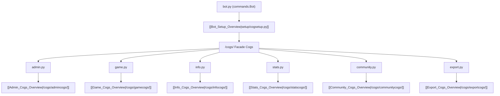

# Cogs Subsystem Architecture Overview

The `/cogs` directory contains the Discord slash command interface layer. Following discord.py best practices, commands are grouped into modular `commands.Cog` classes. Each top-level cog file serves as a facade delegating command logic to specialized submodules in corresponding subdirectories.

## 🧭 Navigation
- **Parent Hub**: [[Root_Project_Overview]]
- **Sub-Cog Overviews**:
  - [[Admin_Cogs_Overview]] (`/cogs/admincogs/`)
  - [[Community_Cogs_Overview]] (`/cogs/communitycogs/`)
  - [[Export_Cogs_Overview]] (`/cogs/exportcogs/`)
  - [[Game_Cogs_Overview]] (`/cogs/gamecogs/`)
  - [[Info_Cogs_Overview]] (`/cogs/infocogs/`)
  - [[Stats_Cogs_Overview]] (`/cogs/statscogs/`)
- **Connected Systems**: [[Bot_Setup_Overview]], [[Game_Engine_Overview]], [[Utilities_Overview]]
- **Requirements Reference**: [[HIGH_LEVEL_REQUIREMENTS#3-High-Level-Requirements-Tables]], [[DETAILED_REQUIREMENTS#2-Technical-Architecture--Directory-Mapping]]

---

## 🏗️ Modular Facade Pattern

---

## 📄 Top-Level Cog Files

| File | Cog Class | Purpose | Delegated Subsystem |
| :--- | :--- | :--- | :--- |
| `admin.py` | `AdminCog` | Game control, lifecycle scheduling, force advancement, and recovery. | [[Admin_Cogs_Overview]] |
| `community.py` | `CommunityCog` | Submitting, reviewing, approving, and displaying player quirks. | [[Community_Cogs_Overview]] |
| `export.py` | `ExportCog` | Exporting game statistics to Google Sheets and JSON backups. | [[Export_Cogs_Overview]] |
| `game.py` | `GameCog` | Player registration, night actions, voting, and status checking. | [[Game_Cogs_Overview]] |
| `info.py` | `InfoCog` | Mafia guides, role descriptions, and rule lookup commands. | [[Info_Cogs_Overview]] |
| `stats.py` | `StatsCog` | Player career records, game metrics, leaderboards, and skill scores. | [[Stats_Cogs_Overview]] |

---

## 🔗 Connected Overviews
- [[Root_Project_Overview]]: Return to Master Hub
- [[Bot_Setup_Overview]]: View how `setup/cogsetup.py` dynamically loads these cogs
- [[Game_Engine_Overview]]: Understand how these cogs call into the state machine
