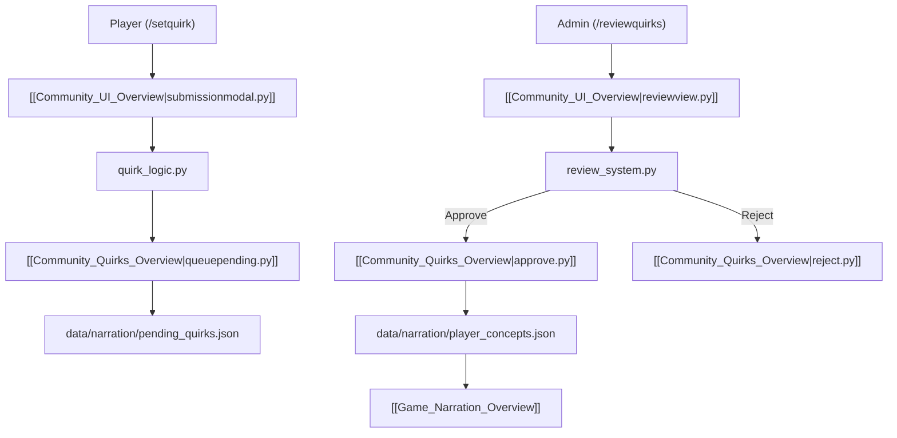

# Community System Architecture Overview

The `/community` directory implements the player personalization and quirk submission engine. Players can submit personal traits, roleplay quirks, or catchphrases which, upon admin moderation, are infused into game story narrations.

## 🧭 Navigation
- **Parent Hub**: [[Root_Project_Overview]]
- **Sub-Modules**:
  - [[Community_Quirks_Overview]] (`/community/quirk/`)
  - [[Community_UI_Overview]] (`/community/ui/`)
- **Connected Systems**: [[Community_Cogs_Overview]], [[Community_Submissions_Data_Overview]], [[Narration_Data_Overview]], [[Game_Narration_Overview]]
- **Requirements Reference**: [[HIGH_LEVEL_REQUIREMENTS#Table-7-Community-Submissions--Quirk-Management]], [[DETAILED_REQUIREMENTS#FR-COM-01-Submit-Player-Quirk]]

---

## 🏗️ Community Architecture

---

## 📄 Root Community Files

| File | Purpose | Key Exports |
| :--- | :--- | :--- |
| `quirk_logic.py` | High-level business logic for validating quirk text lengths, rate limits, and queuing submissions. | `submit_quirk()`, `validate_quirk()` |
| `review_system.py` | Admin review workflow coordinator managing approval, rejection categories, and notifications. | `process_review_action()` |

---

## 🔗 Connected Overviews
- [[Root_Project_Overview]]: Return to Master Hub
- [[Community_Cogs_Overview]]: Slash commands (`/setquirk`, `/reviewquirks`, `/displayquirks`)
- [[Community_UI_Overview]]: Discord modals and button views
- [[Community_Quirks_Overview]]: Low-level file data operations
