# Documentation Hub Overview

The `/docs` directory is the centralized knowledge repository containing formal High-Level Requirements (HLR), Detailed Logic Requirements (DLR), and Project Plans for all sub-initiatives in the IC Mafia ecosystem.

## 🧭 Navigation
- **Parent Hub**: [[Root_Project_Overview]]
- **Documentation Sub-Projects**:
  - [[Mafia_Bot_Docs_Overview]] (`/docs/mafia_bot/`)
  - [[Website_Docs_Overview]] (`/docs/website/`)
  - [[History_Project_Docs_Overview]] (`/docs/history_project/`)
- **Connected Systems**: [[Cogs_Overview]], [[Game_Engine_Overview]], [[Website_Portal_Overview]], [[Mafia_History_Project_Overview]]

---

## 🗺️ Documentation Knowledge Graph

```mermaid
flowchart TD
    DocsHub["[[Documentation_Hub_Overview]]"]
    
    subgraph BotDocs["IC Mafia Bot Docs"]
        BotIndex["[[Mafia_Bot_Docs_Overview]]"]
        BotHLR["[[HIGH_LEVEL_REQUIREMENTS|Bot HLR]]"]
        BotDLR["[[DETAILED_REQUIREMENTS|Bot DLR]]"]
        BotIndex --> BotHLR
        BotIndex --> BotDLR
    end

    subgraph WebDocs["Website Portal Docs"]
        WebIndex["[[Website_Docs_Overview]]"]
        WebPlan["[[WEBSITE_PORTAL_PLAN]]"]
        WebHLR["[[docs/website/HIGH_LEVEL_REQUIREMENTS|Website HLR]]"]
        WebDLR["[[docs/website/DETAILED_REQUIREMENTS|Website DLR]]"]
        WebIndex --> WebPlan
        WebIndex --> WebHLR
        WebIndex --> WebDLR
    end

    subgraph HistDocs["History Project Docs"]
        HistIndex["[[History_Project_Docs_Overview]]"]
        HistPlan["[[HISTORIC_PROJECT_PLAN]]"]
        HistHLR["[[docs/history_project/HIGH_LEVEL_REQUIREMENTS|History HLR]]"]
        HistDLR["[[docs/history_project/DETAILED_REQUIREMENTS|History DLR]]"]
        HistIndex --> HistPlan
        HistIndex --> HistHLR
        HistIndex --> HistDLR
    end

    DocsHub --> BotIndex
    DocsHub --> WebIndex
    DocsHub --> HistIndex
```

---

## 📄 Documentation Projects Matrix

| Sub-Project | Scope | Included Documents | Associated Systems |
| :--- | :--- | :--- | :--- |
| **Core Mafia Bot** | Core Discord bot engine, slash cogs, night action priorities, voting, quirks, and stats. | [[HIGH_LEVEL_REQUIREMENTS]], [[DETAILED_REQUIREMENTS]] | [[Cogs_Overview]], [[Game_System_Overview]], [[Game_Engine_Overview]] |
| **Website Portal** | Responsive web analytics portal, Google Sheets integration, and game history browser. | [[WEBSITE_PORTAL_PLAN]], [[docs/website/HIGH_LEVEL_REQUIREMENTS|Website HLR]], [[docs/website/DETAILED_REQUIREMENTS|Website DLR]] | [[Website_Portal_Overview]], [[Website_Data_Overview]] |
| **History Project** | Historical forum thread extraction, token cleaning, phase detection, and Gemini 3.1 AI summaries. | [[HISTORIC_PROJECT_PLAN]], [[docs/history_project/HIGH_LEVEL_REQUIREMENTS|History HLR]], [[docs/history_project/DETAILED_REQUIREMENTS|History DLR]] | [[Mafia_History_Project_Overview]], [[Website_Data_Overview]] |

---

## 🔗 Connected Overviews
- [[Root_Project_Overview]]: Return to Master Hub
- [[Mafia_Bot_Docs_Overview]]: Explore core bot specifications
- [[Website_Docs_Overview]]: Explore web analytics portal specifications
- [[History_Project_Docs_Overview]]: Explore historic archiving specifications
