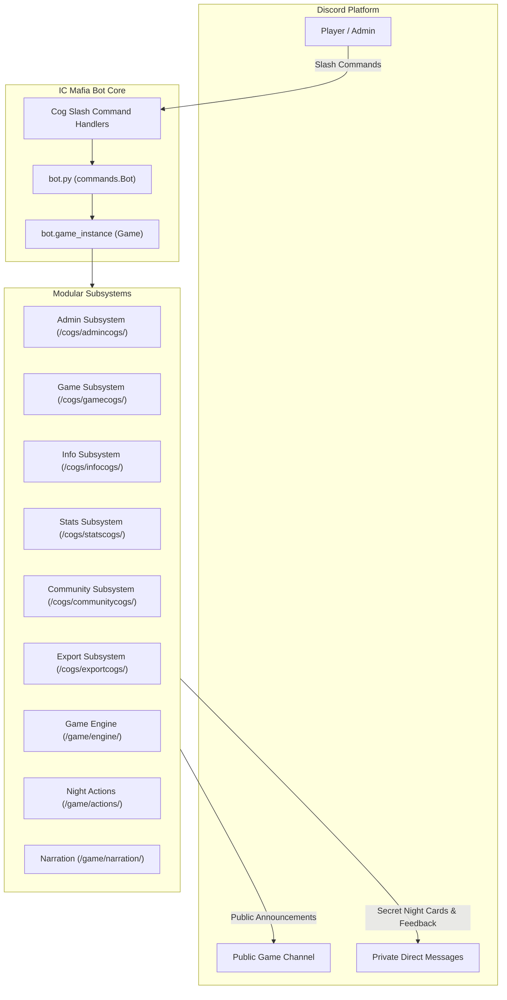

# IC Mafia Bot — High-Level Requirements Document

## 1. Document Overview
This document specifies the high-level functional requirements for the **IC Mafia Bot**, a Discord-based interactive social deduction bot built with `discord.py`. It presents tables of all bot features, actors, triggers, preconditions, and expected business outcomes.

---

## 2. System Architecture & High-Level Flow

---

## 3. High-Level Requirements Tables

### Table 1: Bot Setup, Infrastructure & Lifecycle
| Feature ID | Feature Name | Description | Trigger / Actor | Preconditions | Expected Outcome | Error Handling |
| :--- | :--- | :--- | :--- | :--- | :--- | :--- |
| **INF-01** | Environment Configuration | Loads bot tokens, role IDs, channel IDs, and game constants from `.env` and `config.py`. | Bot startup / System | Valid `.env` file present. | Configuration variables loaded into memory. | Halts startup with error if critical tokens or IDs are missing. |
| **INF-02** | Structured Logging | Configures console and rotating file loggers with custom formatting. | `setup/loggersetup.py` / System | Write permissions on `logs/` directory. | Generates dated debug and error log files. | Falls back to standard console logging if file system is unwritable. |
| **INF-03** | Dynamic Cog Loading | Scans `cogs/` directory and registers top-level cogs into `bot`. | `setup/cogsetup.py` / Bot startup | Cogs subclass `commands.Cog` and contain `setup(bot)`. | All slash command cogs loaded without loading internal subfolders. | Logs failure per cog without crashing remaining extensions. |
| **INF-04** | Global Command Sync | Registers slash application commands with the Discord API. | `setup/cogsetup.py` / Bot startup | Valid bot token with application commands scope. | Slash commands available to server members. | Logs sync failure and rate limits. |
| **INF-05** | Standardized Game State | Maintains a single active game instance accessible across all cogs via `bot.game_instance`. | Bot startup / System | `commands.Bot` initialized. | `bot.game_instance` stores `None` or active `Game` object. | Handlers safely return ephemeral error if game is `None`. |

---

### Table 2: Administration & Game Control
| Feature ID | Feature Name | Description | Trigger / Actor | Preconditions | Expected Outcome | Error Handling |
| :--- | :--- | :--- | :--- | :--- | :--- | :--- |
| **ADM-01** | Admin Permission Guard | Decorator restricting command usage to configured admin role or server administrators. | Slash commands / Admin | User invokes protected command. | Command executes if user has permissions. | Rejects execution with ephemeral "Only admins can use this" message. |
| **ADM-02** | Schedule Game (`/mafiastart`) | Schedules a new game with custom parameters (game type, phase hours, narration type, role thresholds). | `/mafiastart` / Admin | No game active (`bot.game_instance is None`). Start time in future. | Instantiates `Game`, schedules signup loop, announces signup phase in game channel. | Rejects past dates, invalid parameter types, or if a game is already active. |
| **ADM-03** | Force Stop (`/mafiastop`) | Aborts the active game immediately and resets state. | `/mafiastop` / Admin | Active game exists. | Cancels background loops, removes Discord living/dead roles, sets `bot.game_instance = None`. | Ephemeral notice if no game is running. |
| **ADM-04** | Force Start (`/forcestart`) | Ends the signup phase early and immediately transitions to preparation. | `/forcestart` / Admin | Game in `signup` phase with minimum player count. | Bypasses scheduled start time and triggers `prepare_game()`. | Rejects if game is not in signup phase or player count < minimum. |
| **ADM-05** | Force Phase End (`/forcephaseend`) | Forcibly terminates the current Day or Night phase timer immediately. | `/forcephaseend` / Admin | Game is in `day` or `night` phase. | Resolves votes or night actions instantly and advances phase. | Rejects if game is not in an active day/night cycle. |
| **ADM-06** | State Reinitialization (`/mafiareinit`) | Recovers and rebuilds the active player list from server roles after a bot crash. | `/mafiareinit` / Admin | Server contains `Living` and `Dead` role IDs. | Reconstructs `game.players` dictionary mapping member IDs to `Player` objects. | Logs missing roles and returns ephemeral error to admin. |

---

### Table 3: Player Registration & Signups
| Feature ID | Feature Name | Description | Trigger / Actor | Preconditions | Expected Outcome | Error Handling |
| :--- | :--- | :--- | :--- | :--- | :--- | :--- |
| **PLR-01** | Join Game (`/mafiajoin`) | Registers a user into the pending game during signups. | `/mafiajoin` / Player | Game phase is `signup`. Player not already joined. Player count < max. | Creates `Player` object, assigns Discord `Living` role, announces player in game channel. | Ephemeral rejection if already joined, game full, or signups closed. |
| **PLR-02** | Leave Game (`/mafialeave`) | Removes a player from the game during the signup phase. | `/mafialeave` / Player | Game phase is `signup`. Player currently registered. | Removes player from `game.players`, removes `Living` role, notifies channel. | Ephemeral rejection if not signed up or if signups already ended. |
| **PLR-03** | Auto NPC Balancing | Fills empty slots with named NPC bots if configured and needed for minimum threshold. | Engine / `prepare_game` | Player count < required minimum and NPC fill enabled. | Generates NPC `Player` instances with distinct names from `bot_names.txt`. | Cancels game start if minimum human threshold is not reached. |

---

### Table 4: Daytime Phase & Voting System
| Feature ID | Feature Name | Description | Trigger / Actor | Preconditions | Expected Outcome | Error Handling |
| :--- | :--- | :--- | :--- | :--- | :--- | :--- |
| **VOT-01** | Cast Lynch Vote (`/vote`) | Casts or changes a vote to lynch a player during the Day phase. | `/vote [player]` / Living Player | Current phase is `day`. Voter is alive. Target is alive. | Updates `game.lynch_votes`, logs vote event, checks for majority threshold. | Rejects votes from dead players, targeting dead players, or self-votes if disabled. |
| **VOT-02** | Display Vote Tally (`/mafiacount`) | Displays public count of all votes cast in the current Day phase. | `/mafiacount` / Any User | Game active and in `day` phase. | Posts formatted embed showing candidates, current votes, and voters. | Notifies user if no votes have been cast yet or if not in Day phase. |
| **VOT-03** | Majority Lynch Execution | Automatically resolves the Day phase when a candidate reaches > 50% majority of living votes. | Engine / `process_lynch_vote` | Single candidate has `votes > living_players / 2`. | Ends Day early, executes lynch on target, posts narration, triggers Night transition. | Handles ties during timeout by executing no one (No Lynch). |
| **VOT-04** | Inactivity Penalties | Tracks missed votes across Day phases and eliminates unresponsive players. | Engine / `tally_votes` | Player missed maximum allowed consecutive votes (`MAX_MISSED_VOTES`). | Kills inactive player for modkill/inactivity, logs event, posts notice. | Warning sent to player before lethal strike. |

---

### Table 5: Nighttime Phase & Role Actions
| Feature ID | Feature Name | Description | Trigger / Actor | Preconditions | Expected Outcome | Error Handling |
| :--- | :--- | :--- | :--- | :--- | :--- | :--- |
| **ACT-01** | Role Card Delivery (`/myrole`) | Resends the secret role card and ability descriptions to the player. | `/myrole` / Player | Command run in Direct Messages. Player is registered and assigned a role. | DMs role card embed with alignment, abilities, and win conditions. | Rejects if executed in a public guild channel or user has DMs closed. |
| **ACT-02** | Night Action Queue (`/kill`, `/heal`, `/investigate`, `/block`) | Records a player's secret night action target in DMs. | Slash Command / Living Role Holder | Command run in DM. Phase is `night`. Player has matching ability. | Stores action in `game.night_actions[player_id] = {action, target}`. | Rejects if role lacks ability, target is invalid, or used in public channel. |
| **ACT-03** | Action Priority Resolution | Evaluates all queued night actions in strict priority order: Roleblock -> Heal -> Kill -> Investigate. | Engine / `process_night_actions` | Night phase timer expires or all actions submitted. | Resolves blocks first, protections second, deaths third, and delivers investigation reports fourth. | Target protected from kill reports as survived; blocked players receive no results. |
| **ACT-04** | Godfather Promotion | Promotes a Mob Goon to Godfather if the Godfather dies. | Engine / `_resolve_night_deaths` | Godfather killed and living Mob Goons exist. | Upgrades senior Mob Goon to Godfather role and notifies them privately. | No promotion if no living Mob Goons remain. |

---

### Table 6: Narration & Storytelling System
| Feature ID | Feature Name | Description | Trigger / Actor | Preconditions | Expected Outcome | Error Handling |
| :--- | :--- | :--- | :--- | :--- | :--- | :--- |
| **NAR-01** | Event Logging | Aggregates phase events (kills, saves, blocks, investigations, lynches) into Narration queue. | Engine / Action Handlers | Game phase execution. | `NarrationManager.add_event()` records structured event dictionary. | Silently records fallback event if metadata is missing. |
| **NAR-02** | AI Story Generation | Uses Google Gemini LLM to generate narrative chapters based on theme, quirks, and phase events. | `NarrationManager` / Phase transition | `narration_type != 'No Story'`, valid Gemini API key. | Generates rich thematic story chapter and posts to game channel. | Falls back to static templates if API request times out or errors. |
| **NAR-03** | Static Template Fallback | Generates procedural event text using pre-written templates if AI is disabled or fails. | `NarrationManager` / Fallback | AI failure or `narration_type == 'No Story'`. | Posts clean, deterministic narrative recap of phase outcomes. | Always guarantees players receive outcome text. |
| **NAR-04** | Story Log Archival | Appends full game story into a markdown file (`game_<ID>_story.md`) upon game conclusion. | Engine / Game completion | Game concludes with winner. | Writes complete narrative log file in `stats/Production/<Type>/<ID>/`. | Logs file system error if directory unwritable. |

---

### Table 7: Community Quirks & Personality Subsystem
| Feature ID | Feature Name | Description | Trigger / Actor | Preconditions | Expected Outcome | Error Handling |
| :--- | :--- | :--- | :--- | :--- | :--- | :--- |
| **COM-01** | Suggest Quirk (`/set_quirk`) | Opens an interactive Discord modal for users to submit personality quirks for AI narration. | `/set_quirk` / Server Member | Any member in guild or DM. | Queues submission in `data/narration/pending_quirks.json` and alerts admin channel. | Rejects text exceeding 100 characters. |
| **COM-02** | Review Quirks (`/review_quirks`) | Presents admin with approve/reject buttons and dropdown rejection reasons. | `/review_quirks` / Admin | Admin permissions. Pending quirks exist. | Approves (moves to `player_concepts.json`) or rejects with reason DM to submitter. | Ephemeral message if queue is empty. |
| **COM-03** | Display Quirks (`/display_all_quirks`) | Displays all currently approved community quirks. | `/display_all_quirks` / Admin | Admin permissions. | Outputs paginated list of approved users and quirks. | Displays empty notification if no quirks approved. |

---

### Table 8: Statistics, Leaderboards & Data Export
| Feature ID | Feature Name | Description | Trigger / Actor | Preconditions | Expected Outcome | Error Handling |
| :--- | :--- | :--- | :--- | :--- | :--- | :--- |
| **STA-01** | Overall Game Stats (`/gamestats`) | Displays aggregate statistics across all completed games (win rates, game counts). | `/gamestats` / Any User | Past games exist in `stats/`. | Sends embed detailing Town vs Mafia vs SK win rates. | Notifies user if no game history exists. |
| **STA-02** | Individual Player Stats (`/playerstats`) | Displays detailed profile for a specific player (games, win rate, role distribution). | `/playerstats [member]` / Any User | Target player has played >= 1 game. | Sends embed breakdown of member's Mafia history. | Notifies if player has no recorded games. |
| **STA-03** | Skill Score (`/skillscore`) | Calculates and displays a player's weighted skill rating for Classic mode. | `/skillscore [member]` / Any User | Player has played >= 1 Classic game. | Computes rating using standard formula and returns score. | Notifies if player has zero Classic games. |
| **STA-04** | Top Leaderboard (`/leaderboard`) | Displays top 10 rankings by skill score, survival rate, or death rate ("red shirt"). | `/leaderboard [metric]` / Any User | Configured games exist. | Displays top 10 leader table. | Displays empty state if insufficient data. |
| **STA-05** | Hall of Records (`/hall_of_records`) | Displays milestone records (longest game, most votes, most kills). | `/hall_of_records` / Any User | Completed classic games exist. | Sends hall of records summary embed. | Notifies if no records found. |
| **STA-06** | Google Sheets Export (`/exportstats`) | Pushes updated game history and stats to Google Sheets API. | `/exportstats` / Admin | Valid Google API credentials. | Updates remote spreadsheet for website consumption. | Logs authentication error and sends ephemeral failure message. |

