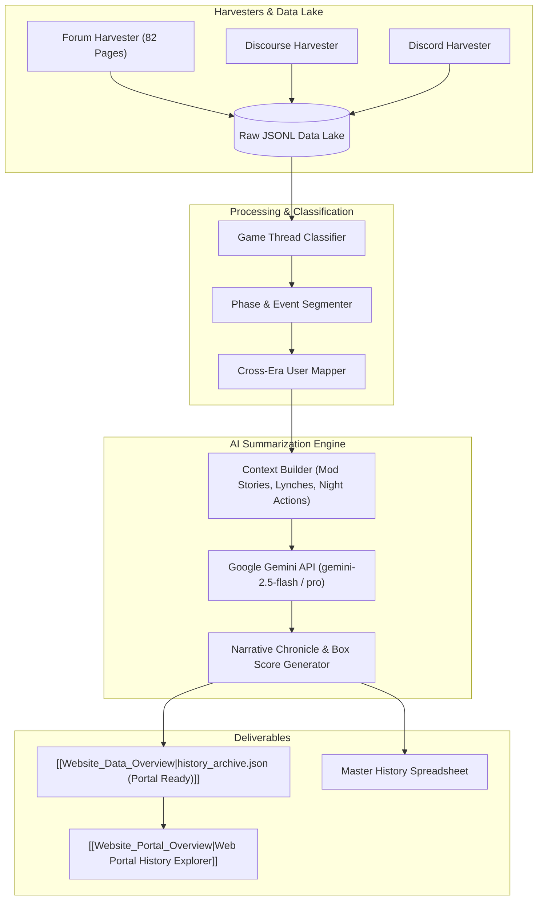

<!-- Obsidian Navigation Header -->
> [!NOTE] Knowledge Graph Navigation
> - **Parent Documentation Hub**: [[Documentation_Hub_Overview]]
> - **History Project Docs Hub**: [[History_Project_Docs_Overview]]
> - **Companion Documents**: [[HISTORIC_PROJECT_PLAN]] | [[docs/history_project/DETAILED_REQUIREMENTS|History DLR]]
> - **Component Overviews**: [[Mafia_History_Project_Overview]], [[Website_Portal_Overview]], [[Website_Data_Overview]]
> - **Root Index**: [[Root_Project_Overview]]

# Imperial Conflict Mafia — Historic Project High-Level Requirements

## 1. Document Overview
This document specifies the high-level functional requirements for the **Imperial Conflict Mafia History Project**, including multi-platform thread harvesting, event segmentation, player identity mapping, and the **AI Summarization Engine** that converts raw historical threads into structured narrative chronicles and game box scores.

---

## 2. System Architecture & Processing Workflow

---

## 3. High-Level Requirements Tables

### Table 1: Ingestion & Multi-Platform Harvesters
| Feature ID | Feature Name | Description | Trigger / Actor | Preconditions | Expected Outcome | Error Handling |
| :--- | :--- | :--- | :--- | :--- | :--- | :--- |
| **HIS-EXT-01** | Forum Thread Harvester | Crawls all 82 pages of `viewforum.php?id=185` and extracts thread metadata (title, URL, thread ID, total posts). | Harvester Script / CLI | Network access to `imperialconflict.com`. | Produces `mafia_threads.json` listing 600+ historical threads. | Retries on HTTP 500/503 errors with exponential backoff. |
| **HIS-EXT-02** | Forum Post Content Scraper | Iterates through thread list, paging through all replies, extracting author, timestamp, post content, and quote blocks. | Batch Script / CLI | `mafia_threads.json` present. | Appends structured post dictionaries into `extracted_history.jsonl`. | Honors `REQUEST_DELAY_SECONDS` (3s) to prevent IP rate-limiting. |
| **HIS-EXT-03** | Discourse Topic Ingestion | Ingests Discourse topics, polling JSON endpoints to retrieve full topic transcripts. | Batch Script / CLI | Discourse board URL accessible. | Appends Discourse transcripts to `discourse_history.jsonl`. | Logs skipped private/deleted topics. |
| **HIS-EXT-04** | Discord History Harvester | Scrapes messages from designated historical Discord channels (`#history-channel`, `#voting-channel`). | Bot command / Script | Bot present in server with Message History permission. | Appends Discord message objects into `old_discord_history.jsonl`. | Handles message pagination and Discord rate limits. |

---

### Table 2: Game Identification & Event Segmentation
| Feature ID | Feature Name | Description | Trigger / Actor | Preconditions | Expected Outcome | Error Handling |
| :--- | :--- | :--- | :--- | :--- | :--- | :--- |
| **HIS-SEG-01** | Thread Classification | Categorizes raw threads into Game Threads, Signup Threads, Commentary/General threads, and Rules threads. | Pipeline runner / System | Raw thread JSON loaded. | Labels thread type, extracts game title and sequence number (e.g. "Mafia 54"). | Flags ambiguous threads for manual administrator review. |
| **HIS-SEG-02** | Phase Boundary Detection | Scans moderator posts to identify transitions: Game Start, Day Phase, Night Phase, Lynch Resolution, and Game End. | Text analyzer / System | Classified game thread. | Creates chronological phase segments mapping post ranges to game phases. | Falls back to author-timestamp clustering if standard headers are absent. |
| **HIS-SEG-03** | Vote & Lynch Extraction | Parses moderator vote tallies and player bolded votes (`**Vote: Player**`) to determine lynch victims and voting records. | Regex / NLP parser | Phase segmented thread. | Extracts target, total votes received, and execution result. | Logs unparsed voting rounds for LLM context verification. |
| **HIS-SEG-04** | Endgame Reveal Extraction | Locates and parses moderator post-game reveal posts containing true role alignments and secret night action submissions. | Text analyzer / System | Concluding posts of thread. | Extracts full player roster, assigned roles, winning faction, and action history. | If no reveal post exists, passes raw final posts to AI engine for inference. |

---

### Table 3: Cross-Era Identity Resolution
| Feature ID | Feature Name | Description | Trigger / Actor | Preconditions | Expected Outcome | Error Handling |
| :--- | :--- | :--- | :--- | :--- | :--- | :--- |
| **HIS-MAP-01** | Author Handle Harvesting | Collects unique author handles across Forum, Discourse, and Discord data lakes. | Pipeline execution | Input JSONL files populated. | Produces distinct author dictionary with post counts and active era dates. | Normalizes casing, whitespace, and special characters. |
| **HIS-MAP-02** | Google Sheet Import | Connects via `gspread` to the curated Master Historical Google Sheet to fetch the canonical username-to-Discord mappings. | `user_mapper_exporter.py` | Google service account credentials valid. | Downloads latest curated mappings directly from the cloud. | Fails gracefully if Google Sheets API is unauthorized or rate-limited. |
| **HIS-MAP-03** | Multi-ID JSON Generation | Parses the downloaded sheet, explicitly splitting comma-separated Discord IDs (for users with multiple accounts), and generates `master_user_map.json`. | `user_mapper_exporter.py` | Google Sheet imported successfully. | Creates a unified JSON lookup dictionary for downstream pipeline consumption. | Skips rows with malformed data but logs warnings. |

---

### Table 4: AI Narrative & Game Summarization Engine
| Feature ID | Feature Name | Description | Trigger / Actor | Preconditions | Expected Outcome | Error Handling |
| :--- | :--- | :--- | :--- | :--- | :--- | :--- |
| **HIS-SUM-01** | Historical Prompt Construction | Synthesizes moderator story posts, vote counts, night actions, and notable player comments into a structured prompt context. | Summarizer pipeline | Thread events segmented. | Assembles chronological prompt within model token budget. | Truncates casual spam/banter posts while preserving critical mod & player posts. |
| **HIS-SUM-02** | Narrative Game Chronicle Synthesis | Calls Google Gemini LLM to generate an engaging, thematic story summarizing the game's drama, twists, and storyline. | Gemini API runner | Valid `GOOGLE_AI_API_KEY`. | Produces multi-chapter markdown chronicle written in engaging prose. | Retries on API timeout; falls back to mechanical outline on failure. |
| **HIS-SUM-03** | Mechanical Box Score Extraction | Prompts LLM to output structured JSON containing Winning Faction, MVP, Final Roster, and Day-by-Day Eliminations. | Gemini API runner | Phase events parsed. | Produces validated JSON matching `MechanicalBoxScore` schema. | Validates JSON against schema; re-prompts if malformed. |
| **HIS-SUM-04** | Tactical Play & Blunder Analysis | AI analyzes pivotal voting blunders, clutch cop investigations, or mafia deception plays that swung the outcome. | Summarizer pipeline | Narrative & Box Score generated. | Generates "Notable Plays & Key Moments" section for the match record. | Summarizes general game progression if no standout play is detected. |
| **HIS-SUM-05** | Batch Summarization Runner | Batch script processing entire catalog of historic games with rate-limit pacing and checkpoint resumption. | CLI / Admin runner | Batch queue populated. | Processes 10-50 games sequentially, caching completed JSON summaries. | Skips already completed summaries on rerun (resume capability). |

---

### Table 5: Serialization & Web Portal Delivery
| Feature ID | Feature Name | Description | Trigger / Actor | Preconditions | Expected Outcome | Error Handling |
| :--- | :--- | :--- | :--- | :--- | :--- | :--- |
| **HIS-EXP-01** | Web Portal History JSON Export | Compiles all summarized historic games into optimized `Website/data/history_archive.json`. | Export command / CLI | Summaries generated. | Generates compact, client-ready JSON file for portal consumption. | Validates total file size (< 15MB) and compresses if necessary. |
| **HIS-EXP-02** | Search Index Generation | Builds lightweight text search index over historic thread titles, authors, MVPs, and game summaries. | Build script | `history_archive.json` built. | Enables instant (< 10ms) search queries in the web portal browser. | Fallback to client-side linear substring search if index fails. |
| **HIS-EXP-03** | All-Time Stats Aggregation | Combines historical game records with modern bot game stats to create unified All-Time Player Rankings. | Export pipeline | Roster mappings verified. | Computes career wins, games played, and survival rates across all eras. | Flags unmapped players in separate "Vintage Records" section. |

---

## 🔗 Obsidian Knowledge Graph Links
- **Master Root Index**: [[Root_Project_Overview]]
- **Documentation Hub**: [[Documentation_Hub_Overview]]
- **History Project Docs Hub**: [[History_Project_Docs_Overview]]
- **History Project Plan**: [[HISTORIC_PROJECT_PLAN]]
- **Detailed Requirements**: [[docs/history_project/DETAILED_REQUIREMENTS|History DLR]]
- **Connected Overviews**:
  - [[Mafia_History_Project_Overview]]: Extractor scripts and Gemini LLM summarizer
  - [[Website_Portal_Overview]]: Web viewer
  - [[Website_Data_Overview]]: Historic archive data
