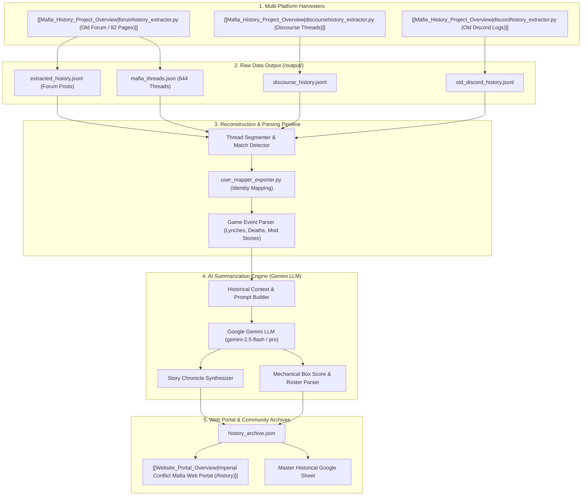

<!-- Obsidian Navigation Header -->
> [!NOTE] Knowledge Graph Navigation
> - **Parent Documentation Hub**: [[Documentation_Hub_Overview]]
> - **History Project Docs Hub**: [[History_Project_Docs_Overview]]
> - **Companion Documents**: [[docs/history_project/HIGH_LEVEL_REQUIREMENTS|History HLR]] | [[docs/history_project/DETAILED_REQUIREMENTS|History DLR]]
> - **Component Overviews**: [[Mafia_History_Project_Overview]], [[Website_Portal_Overview]], [[Website_Data_Overview]]
> - **Root Index**: [[Root_Project_Overview]]

# Imperial Conflict Mafia — Historic Project Plan & AI Summarization Engine

## 1. Executive Summary & Project Mission

The **Imperial Conflict Mafia History Project** is a digital preservation and intelligence initiative designed to reconstruct, analyze, and chronicle over a decade of Imperial Conflict Mafia games (2012 to Present).

Across hundreds of historic forum threads, Discourse discussions, and legacy Discord servers, countless memorable games, legendary plays, community rivalries, and written narrative stories were created. However, this history is currently fragmented across raw JSONL scrapes, unformatted forum dumps, and disconnected usernames.

This project delivers:
1. **Multi-Era Data Extraction & Ingestion**: Harvesting and organizing raw game threads from the Old Forum (2012–2020), Discourse, and Discord.
2. **Unified Player Identity Resolution**: Cross-referencing historical forum aliases with modern Discord identities via `username_mapping_template.csv`.
3. **Automated Game Event & Action Reconstruction**: Parsing raw posts to detect Moderator Story posts, vote counts, lynch executions, and endgame night-action reveal posts.
4. **AI-Powered Game Chronicle & Summarization Engine**: Using the Google Gemini LLM to synthesize narrative stories, player comments, night actions, and day lynches into engaging, readable **Game Chronicles** and structured **Mechanical Box Scores**.
5. **Seamless Web Portal Integration**: Exporting clean, structured JSON archives directly into the Imperial Conflict Mafia Web Portal.

---

## 2. End-to-End Processing Architecture

---

## 3. Core Engine: AI Game Summarizer & Story Synthesizer

The cornerstone of the Historic Project is the **AI Summarization Engine**, which processes noisy forum/chat threads and converts them into structured historical records:

### 3.1 What the AI Ingests:
1. **Moderator Phase Posts**: Opening theme stories, Day beginning/ending announcements, Lynch vote resolution posts, and Night death stories.
2. **Key Player Discourse**: Notable accusations, defenses, claims (e.g. Cop claims, Doctor claims), and memorable quotes.
3. **Endgame Reveal Posts**: Moderator debriefs listing the full player roster, true alignments, hidden roles, and secret night action submissions.
4. **Vote Tallies**: Automated or moderator-posted vote counts leading to eliminations.

### 3.2 What the Pipeline Produces (Dual Narrative & Summary Architecture):
* **The AI Summary Chronicle (`narrative_chronicle`)**:
  A 3–5 chapter literary prose summary formatted in markdown that captures the match's theme, tactical turning points, clutch deceptions, and dramatic climax. Displayed in the portal's **📋 Game Summary** tab.
* **The Original Stories As Written (`story_as_written`)**:
  The authentic verbatim moderator story posts as written during the game by the host (Prologue theme & lore, Day/Night phase announcements, murder mystery vignettes, vote counts, and final endgame debrief). Displayed in the portal's **📖 Stories as Written** tab.
* **The Mechanical Box Score (`box_score`)**:
  * **Winning Faction**: Town, Mafia, Serial Killer, or Draw.
  * **Game MVP / Standout Player**: The player who exerted the most decisive impact with analytical rationale.
  * **Phase-by-Phase Timeline**:
    * Day 1: Lynch target, vote count, alignment revealed.
    * Night 1: Victims, known protections/blocks.
    * Day 2+: Escalation and final victory condition.
  * **Complete Roster Table**: Player, Era Username, Mapped Discord User, Assigned Role, Survival Status, Elimination Phase.

---

## 4. Multi-Era Taxonomy

The history is segmented into four distinct eras:

| Era | Period | Primary Medium | Characteristics | Source Files |
| :--- | :--- | :--- | :--- | :--- |
| **Forum Era** | 2012 – 2020 | Imperial Conflict PHPBB Forum (`id=185`) | Highly literary, long 24–48h phases, long narrative mod stories, 644 archived threads. | `extracted_history.jsonl`, `mafia_threads.json` |
| **Discourse Era** | 2020 – 2022 | Discourse Community Board | Formatted threads, structured polls, transition towards automated mechanics. | `discourse_history.jsonl` |
| **Discord Era** | 2022 – 2024 | Discord Channels (`#history-channel`, `#voting-channel`) | Fast-paced, chat-driven social deduction, bot assistance precursors. | `old_discord_history.jsonl` |
| **Modern Bot Era** | 2025 – Present | Discord Bot (`IC Mafia Bot`) | Fully automated phase timers, secret DM action queue, Gemini AI narration, automated stats. | `stats/Production/` |

---

## 5. Phased Implementation Roadmap

### Phase 1: Data Audit & Scrape Completion
* Review existing 644 threads in `mafia_threads.json` and posts in `extracted_history.jsonl`.
* Verify complete pagination harvest of `viewforum.php?id=185` (confirming all 82 pages harvested).
* Validate Discourse scraper (`discoursehistory_extractor.py`), ensuring topics are harvested via `/t/{topic_id}.json` endpoint to write clean transcripts to `discourse_history.jsonl`.
* Validate Discord scraper output files.

### Phase 2: Game Event & Boundary Detector
* Implement thread classifier script (`classify_game_threads.py`):
  * Differentiates actual game threads from signup threads, commentary/discussion threads, and rule threads across both Forum and Discourse catalogs.
  * Extracts metadata: Game Number (e.g. "Mafia 54", "Mafia 88: Imperial Kitchen"), Host/Moderator name, Start Date, Total Posts.
* Build phase segmenter: identifies posts containing keyword markers like `Day 1 Begins`, `Night 1 Resolution`, `Vote Count`, `Game Over`.

### Phase 3: AI Summarization Pipeline (`summarize_historic_games.py` / `batch_summarize.py`)
* Implement Gemini LLM prompt pipeline with chunking and token optimization.
* Extract moderator opening posts, phase resolutions, and endgame reveals from both Forum and Discourse JSONL archives.
* Synthesize narrative chapters and structured JSON box scores for each historic game.
* Cache generated summaries in `output/summaries/game_<ID>_summary.json` (supporting both Forum and Discourse game IDs).

### Phase 4: Identity Resolution & Roster Normalization
* Execute `user_mapper_exporter.py` against all summarized games.
* Populate `username_mapping_template.csv` to map vintage forum handles (e.g. `LordVader`) to modern Discord tags.
* Merge career statistics across eras into a unified player table.

### Phase 5: Web Portal Ingestion & Multi-Tab Viewer
* Compile all verified historic games into `Website/data/history_archive.json` with both `narrative_chronicle` and `story_as_written`.
* Enable the **"🏛️ Mafia History Archive"** tab on the web portal with era filtering, thread search, and a four-view modal:
  1. **📋 Game Summary**: The AI narrative chronicle, match synopsis, MVP, and tactical highlights.
  2. **📖 Stories as Written**: The authentic, verbatim moderator story posts from the original match.
  3. **⚡ Phase Play-by-Play & Timeline**: Chronological event cards, casualties, and vote tally breakdowns.
  4. **👥 Cast & Box Score**: Full player roster table with roles, alignments, and survival statuses.

---

## 🔗 Obsidian Knowledge Graph Links
- **Master Root Index**: [[Root_Project_Overview]]
- **Documentation Hub**: [[Documentation_Hub_Overview]]
- **History Project Docs Hub**: [[History_Project_Docs_Overview]]
- **High-Level Requirements**: [[docs/history_project/HIGH_LEVEL_REQUIREMENTS|History HLR]]
- **Detailed Requirements**: [[docs/history_project/DETAILED_REQUIREMENTS|History DLR]]
- **Connected Overviews**:
  - [[Mafia_History_Project_Overview]]: History pipeline extractor and AI engine
  - [[Website_Portal_Overview]]: Web portal history viewer
  - [[Website_Data_Overview]]: History archive JSON data
