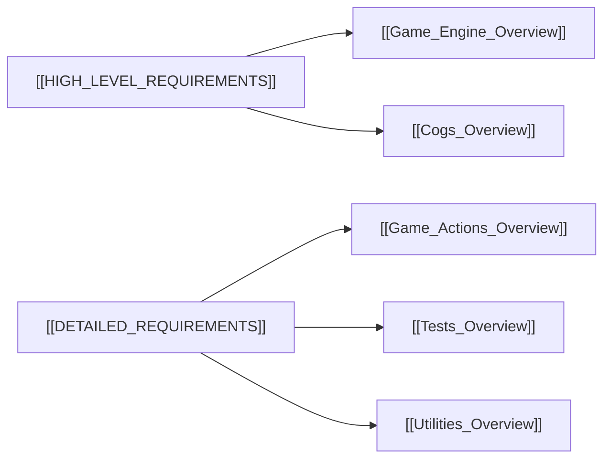

# Mafia Bot Documentation Subsystem Overview

The `/docs/mafia_bot` directory contains the complete architectural specifications and formal requirements for the Discord **IC Mafia Bot**.

## 🧭 Navigation
- **Parent Hub**: [[Documentation_Hub_Overview]]
- **Connected Systems**: [[Game_Engine_Overview]], [[Game_Actions_Overview]], [[Cogs_Overview]], [[Bot_Setup_Overview]], [[Utilities_Overview]], [[Tests_Overview]]

---

## 📄 Documents in this Directory

| Document | Obsidian Link | Scope & Purpose |
| :--- | :--- | :--- |
| **High-Level Requirements** | [[HIGH_LEVEL_REQUIREMENTS]] | Functional requirement tables (INF, ADM, PLR, VOT, ACT, NAR, COM, STA, QA) detailing actors, triggers, preconditions, and expected outcomes. |
| **Detailed Requirements** | [[DETAILED_REQUIREMENTS]] | Architectural deep dives into state machine transitions, night action priority ordering, Google Sheets schema, file mapping, and verification strategy. |

---

## 🔄 Cross-System Mapping

---

## 🔗 Connected Overviews
- [[Documentation_Hub_Overview]]: Return to Docs Hub
- [[Game_Engine_Overview]]: The game engine implementing these requirements
- [[Game_Actions_Overview]]: Handlers implementing night actions
