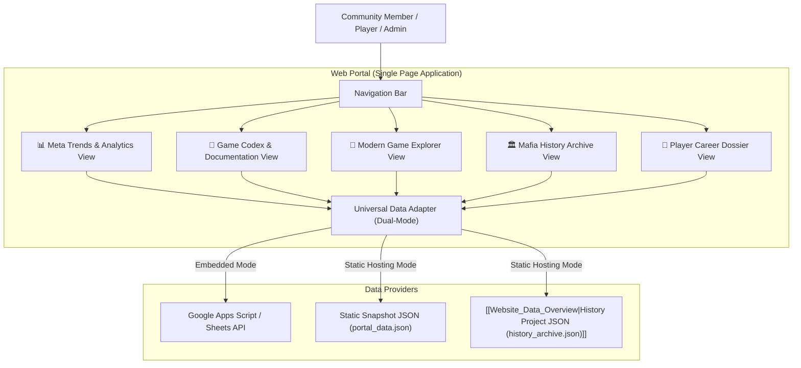

<!-- Obsidian Navigation Header -->
> [!NOTE] Knowledge Graph Navigation
> - **Parent Documentation Hub**: [[Documentation_Hub_Overview]]
> - **Website Docs Hub**: [[Website_Docs_Overview]]
> - **Companion Document**: [[docs/website/DETAILED_REQUIREMENTS|Website DLR]] | [[WEBSITE_PORTAL_PLAN]]
> - **Component Overviews**: [[Website_Portal_Overview]], [[Website_Data_Overview]], [[Mafia_History_Project_Overview]]
> - **Root Index**: [[Root_Project_Overview]]

# Imperial Conflict Mafia — Web Portal High-Level Requirements

## 1. Document Overview
This document specifies the high-level functional requirements for the **Imperial Conflict Mafia Web Portal**. It defines all user-facing features, actors, preconditions, triggers, expected outcomes, and error handling behaviors across the portal's analytics, documentation, game explorer, player dossier, and historical modules.

---

## 2. High-Level Architecture & User Journey

---

## 3. High-Level Requirements Tables

### Table 1: Portal Core & Infrastructure
| Feature ID | Feature Name | Description | Trigger / Actor | Preconditions | Expected Outcome | Error Handling |
| :--- | :--- | :--- | :--- | :--- | :--- | :--- |
| **WEB-INF-01** | Dual-Mode Data Ingestion | Automatically detects whether runtime is Google Apps Script or standalone web browser, fetching data via `google.script.run` or static `fetch()` respectively. | Page load / System | Browser supports ES6 fetch or GAS environment. | Loads portal data seamlessly without throwing `google is not defined` errors. | Displays user-friendly error card if both data channels fail to load. |
| **WEB-INF-02** | Thematic Dark Design System | Applies cohesive dark aesthetic (`--bg: #121212`, `--card: #1e1e1e`) with faction accent colors (Town Blue, Mafia Red, Neutral Orange, Gold). | CSS Initialization | Modern browser with CSS custom property support. | Uniform, legible dark-mode UI across all screens and components. | Graceful fallback to dark gray base palette if theme fails. |
| **WEB-INF-03** | Responsive SPA Navigation | Provides instant client-side tab switching between Analytics, Codex, Games, History, and Player views without full page reloads. | Tab click / User | JavaScript enabled. | Transitions active view with URL hash tracking (`#analytics`, `#codex`, `#games`, `#history`). | Defaults to `#analytics` or `#codex` if invalid hash is provided. |
| **WEB-INF-04** | Client-Side Sorting & Filtering | Real-time sorting and text filtering on all data tables (leaderboards, game lists, historical threads). | Table header click / Input typing | Data loaded in memory. | Instant DOM reordering or row filtering (< 50ms latency) supporting numeric, string, and percentage sorting. | Restores original order on reset; shows "No matching results" on zero matches. |

---

### Table 2: Analytics & Meta Trends
| Feature ID | Feature Name | Description | Trigger / Actor | Preconditions | Expected Outcome | Error Handling |
| :--- | :--- | :--- | :--- | :--- | :--- | :--- |
| **WEB-ANA-01** | Classic Mode Dashboard | Displays aggregate stats (total games, Town wins, Mafia wins, Neutral wins, Draws) with win percentages. | Select Classic Tab / User | Game dataset contains Classic matches. | Displays KPI stat boxes and Town vs Mafia win rate badges. | Shows empty state if zero Classic games are recorded. |
| **WEB-ANA-02** | Meta Trendline Visualizer | Interactive Chart.js stacked area/line chart showing faction win rate evolution over time. | Page render / System | Valid chronological game history. | Renders interactive chart showing rolling faction dominance with hover tooltips. | Displays placeholder graphic if fewer than 3 games exist. |
| **WEB-ANA-03** | Battle Royale Dashboard | Displays total BR matches, round survival distribution, and Hall of Champions leaderboard bar chart. | Select BR Tab / User | Game dataset contains Battle Royale matches. | Renders horizontal bar chart of champion wins and combatant survival stats table. | Shows empty state if zero BR games exist. |
| **WEB-ANA-04** | 18-Metric Hall of Records | Interactive dropdown ranking top 10 players across competitive scores, survivals, deaths, and faction games. | Dropdown select / User | Minimum games threshold met (default > 5 games). | Dynamically sorts and renders top 10 table with rank badges (🥇, 🥈, 🥉) and formatted values. | Displays message if no players meet the minimum games threshold. |
| **WEB-ANA-05** | Role Win-Rate Heatmap | Visual grid displaying win percentages and appearance frequencies across individual roles (Cop, Doctor, Godfather, etc.). | Toggle Heatmap / User | Game history with role-level outcome tracking. | Renders color-coded matrix highlighting role balance and faction contribution. | Hides roles with insufficient sample sizes (< 3 appearances). |

---

### Table 3: Game Codex & Documentation
| Feature ID | Feature Name | Description | Trigger / Actor | Preconditions | Expected Outcome | Error Handling |
| :--- | :--- | :--- | :--- | :--- | :--- | :--- |
| **WEB-CDX-01** | Interactive Role Compendium | Visual cards generated from `role_definition.json` displaying role name, alignment, abilities, immunities, and win conditions. | Navigate to Codex / User | JSON role definitions available. | Searchable and filterable grid of role cards grouped by faction (Town, Mafia, Neutral). | Shows error state if `role_definition.json` cannot be fetched. |
| **WEB-CDX-02** | Game Mode Comparison | Clear tabular comparison detailing rules, win conditions, and phase dynamics between Classic Mafia and Battle Royale. | Select Rules Section / User | None. | Structured comparison table explaining social deduction vs free-for-all elimination. | Static fallback content embedded in HTML. |
| **WEB-CDX-03** | "Moneyball" Formula Explainer | Interactive visual calculator explaining the Classic Skill Score formula: Skill = w1*P + w2*E + w3*U. | Interact with formula / User | None. | Users adjust sliders for Persuasion (P), Elusiveness (E), and Understanding (U) to see how ratings are computed. | Resets sliders to default baseline weights on click. |
| **WEB-CDX-04** | Slash Command Reference | Categorized documentation for all 27 bot slash commands, divided into Public, DM Secret Actions, and Admin. | Search / Browse Commands | None. | Searchable command cards with parameter descriptions, required channels, and example usage. | Highlights required permissions (e.g., Admin Only). |
| **WEB-CDX-05** | Quirk Submission Guide | Explains how community quirks work in AI storytelling, character limits, and the approval pipeline. | Browse Quirk Guide / User | None. | Illustrated guide demonstrating how to use `/set_quirk` and how quirks appear in generated stories. | Static guide always rendered. |

---

### Table 4: Modern Game Explorer & Narrative Reader
| Feature ID | Feature Name | Description | Trigger / Actor | Preconditions | Expected Outcome | Error Handling |
| :--- | :--- | :--- | :--- | :--- | :--- | :--- |
| **WEB-GME-01** | Modern Game Registry | Searchable and paginated table listing all bot-completed games with Game ID, Date, Mode, Winner, and Phase Count. | Select Games Tab / User | Game archive data loaded. | Responsive table with filters for Winner (Town/Mafia/Draw) and Game Type (Classic/BR). | Shows "No games match filter criteria" when search returns empty. |
| **WEB-GME-02** | Interactive Phase Timeline | Chronological event timeline for a selected game showing Day lynches, Night kills, saves, and promotions phase by phase. | Click on Game Row / User | Selected game has archived phase data. | Opens interactive timeline modal/page detailing each phase's action events. | Shows notice if detailed phase events were not recorded for that match. |
| **WEB-GME-03** | AI Narrative Story Reader | Dedicated book-style reader displaying the AI-generated story chapters (`game_<ID>_story.md`) for the match. | Click "Read Story" / User | Game has associated story log. | Renders formatted markdown narrative with thematic styling (e.g., Cyberpunk, Fantasy, Classic). | Falls back to static phase recap if AI story was disabled for that match. |
| **WEB-GME-04** | Game Roster & Box Score | Summary card displaying all participating players, their assigned roles, alive/dead status at game end, and victory status. | Inspect Game / User | Player list available in game metadata. | Visual roster with alignment badges and death phase indicators. | Displays placeholder for unrevealed roles if game is ongoing. |

---

### Table 5: Player Career Dossiers
| Feature ID | Feature Name | Description | Trigger / Actor | Preconditions | Expected Outcome | Error Handling |
| :--- | :--- | :--- | :--- | :--- | :--- | :--- |
| **WEB-DOS-01** | Player Profile Lookup | Search bar allowing users to find any player's career history by typing their Discord username. | Search username / User | Player has played >= 1 recorded game. | Opens Player Dossier card with overall win rate, survival rate, and career games. | Ephemeral warning: "Player not found in records." |
| **WEB-DOS-02** | Role Affinity Breakdown | Chart/table showing how many times a player was assigned each role and their corresponding win rate. | View Dossier / User | Player record contains role history. | Visual breakdown (e.g. 60% Townie, 25% Goon, 10% Doctor, 5% SK) with win percentages. | Shows "No role history available" if unrecorded. |
| **WEB-DOS-03** | Nemesis & Partner Analysis | Displays the teammates a player has won with most often, and the killers who have eliminated them most often. | View Dossier / User | Sufficient game records available. | Lists top 3 allies and top 3 adversaries. | Hides section if fewer than 5 games played. |
| **WEB-DOS-04** | Achievement Badges | Displays unlocked community badges (e.g., Untouchable, Mastermind, First Blood Survivor, Red Shirt Veteran). | View Dossier / User | Player stats evaluated against achievement criteria. | Renders earned badge icons with tooltips explaining unlock conditions. | Shows unearned badges in grayed-out locked state. |

---

### Table 6: Mafia History Project Integration
| Feature ID | Feature Name | Description | Trigger / Actor | Preconditions | Expected Outcome | Error Handling |
| :--- | :--- | :--- | :--- | :--- | :--- | :--- |
| **WEB-HIS-01** | Multi-Era Timeline Selector | Filter to toggle between different Imperial Conflict eras: Forum Era (2012–2020), Discourse Era, Discord Era, and Bot Era. | Click Era Button / User | History archive JSON loaded. | Updates historical catalog to display threads and games belonging to the selected era. | Defaults to "All Eras" if selected era has no games. |
| **WEB-HIS-02** | Historic Thread Catalog | Searchable index of 600+ historical forum threads and games with thread titles, start dates, post counts, and external links. | Search / Browse History | History dataset loaded. | Fast paginated list of historical threads with links to original forum posts. | Displays empty search notification if query yields no matches. |
| **WEB-HIS-03** | AI Historical Game Summaries | Displays synthesized narrative and mechanical summaries for historic forum games generated by the History Project LLM pipeline. | Click on Historic Game / User | Summary generated and stored in history archive. | Renders structured recap: Game Summary, Final Outcome, Notable Plays, and Player Roster. | Displays raw thread metadata if AI summary is not yet generated. |
| **WEB-HIS-04** | Cross-Era Player Bridge | Links a historical forum username to modern Discord identities using `username_mapping_template.csv`. | Click historical author / User | Mapping exists in template. | Shows connected player profiles across eras (e.g., "Forum: DarthVader -> Discord: @Skywalker"). | Displays unmapped indicator if author handle was never linked. |

---

## 🔗 Obsidian Knowledge Graph Links
- **Master Root Index**: [[Root_Project_Overview]]
- **Documentation Hub**: [[Documentation_Hub_Overview]]
- **Website Docs Hub**: [[Website_Docs_Overview]]
- **Website Development Plan**: [[WEBSITE_PORTAL_PLAN]]
- **Website Detailed Requirements**: [[docs/website/DETAILED_REQUIREMENTS|Website DLR]]
- **Connected Overviews**:
  - [[Website_Portal_Overview]]: Web application files
  - [[Website_Data_Overview]]: Historical JSON archives
  - [[Mafia_History_Project_Overview]]: History pipeline extractor
