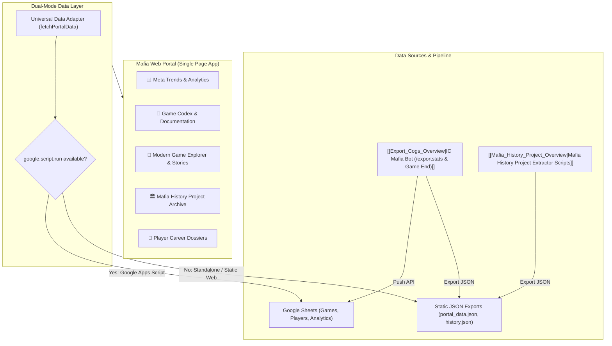

<!-- Obsidian Navigation Header -->
> [!NOTE] Knowledge Graph Navigation
> - **Parent Documentation Hub**: [[Documentation_Hub_Overview]]
> - **Website Docs Hub**: [[Website_Docs_Overview]]
> - **Companion Requirements**: [[docs/website/HIGH_LEVEL_REQUIREMENTS|Website HLR]] | [[docs/website/DETAILED_REQUIREMENTS|Website DLR]]
> - **Component Overviews**: [[Website_Portal_Overview]], [[Website_Data_Overview]], [[Mafia_History_Project_Overview]]
> - **Root Index**: [[Root_Project_Overview]]

# Imperial Conflict Mafia — Web Portal & History Archive Plan

## 1. Executive Summary & Vision

The **Imperial Conflict Mafia Web Portal** is an all-in-one community hub, analytics dashboard, rules documentation portal, and historical repository for the Imperial Conflict Mafia community. 

While the existing website ([[Website_Portal_Overview|Website/index.html]]) provides initial leaderboard tables and a faction trend chart powered exclusively by Google Sheets/Google Apps Script, this enhancement plan outlines the transformation of the site into an interactive, high-performance web portal that serves four primary objectives:

1. **Overall Meta Trends & Analytics**: Rich, visual metrics for both Classic Mafia and Battle Royale modes, including faction balance trends, role win-rate heatmaps, and a 18-metric Hall of Records.
2. **Game Codex & Comprehensive Documentation**: Complete player rulebooks, interactive role definition cards, slash command references, quirk submission guides, and transparent explanations of scoring formulas (e.g., the $P, E, U$ Skill Score).
3. **Modern Game Explorer & Story Reader**: Searchable database of past games run by the IC Mafia Bot, complete with phase-by-phase event timelines and full AI narrative chapter logs.
4. **Mafia History Project Integration**: Searchable archives spanning over a decade of Imperial Conflict Mafia lore (Forum Era 2012–2020, Discourse Era, Discord Era), backed by cross-era username mapping.

---

## 2. System Architecture & Dual-Mode Data Layer

The portal will adopt a **Dual-Mode Data Architecture** allowing it to run both as a standalone static web application (hosted on GitHub Pages, Cloudflare Pages, Vercel, or local browser) and as an embedded Google Apps Script web app inside Google Sheets.



### Universal Data Fetcher Implementation Pattern
```javascript
async function fetchPortalData(endpoint) {
    // 1. Google Apps Script Context (Embedded in Sheets)
    if (typeof google !== 'undefined' && google.script && google.script.run) {
        return new Promise((resolve, reject) => {
            google.script.run
                .withSuccessHandler(resolve)
                .withFailureHandler(reject)
                .getDashboardData(endpoint);
        });
    }
    // 2. Standalone / Static Web Hosting Context
    const response = await fetch(`./data/${endpoint}.json`);
    if (!response.ok) throw new Error(`Failed to load ${endpoint}.json`);
    return await response.json();
}
```

---

## 3. Detailed Portal Modules & Feature Specifications

### Module 1: Meta Trends & Analytics
* **Classic Mode Dashboard**:
  * Total games played, faction win totals, and percentage distribution (Town, Mafia, Neutral, Draw).
  * Rolling 10-game meta balance line chart (visualizing whether Town or Mafia currently dominates).
  * Average game duration (in phases and calendar days).
* **Battle Royale Dashboard**:
  * Total matches, combatant leaderboard, Hall of Champions bar chart.
  * Night 1 fatality rates and survival curves across rounds.
* **Granular Hall of Records**:
  * 18-metric dropdown ranking top players across:
    * *Competitive*: Skill Score, Survival Rate, Red Shirt Rate, Scumhunting Accuracy.
    * *Participation*: Most Games, Most Wins, Most Losses.
    * *Faction Loyalty & Success*: Town/Mafia/SK Games and Win counts.
    * *Tragedy*: Total Lynches, Day 1 Lynches, Total Night Deaths, Night 1 Deaths.

---

### Module 2: Game Codex & Documentation
* **Rulebook Comparison**:
  * Clear comparison between **Classic Mafia** (social deduction, day lynches, secret night actions, faction win conditions) and **Battle Royale** (everyone is a Vigilante, fast-paced elimination).
* **Interactive Role Cards**:
  * Dynamic cards generated directly from `data/game_setup/role_definition.json` with faction badges, abilities, night action priorities, and win conditions:
    * **Town**: Plain Townie, Town Cop, Town Doctor, Town Role Blocker.
    * **Mafia**: Godfather (night immune, investigate immune), Mob Goon, Mob Role Blocker.
    * **Neutral**: Serial Killer (night immune, solo win), Jester (lynch win), Vigilante (Battle Royale).
* **"Moneyball" Skill Score Formula Explainer**:
  * Interactive breakdown of the weighted rating formula:
    $$\text{Skill Score} = w_1 \cdot P (\text{Persuasion}) + w_2 \cdot E (\text{Elusiveness}) + w_3 \cdot U (\text{Understanding})$$
  * Explains how voting on winning candidates ($P$), avoiding night/day elimination ($E$), and aligning with correct factions ($U$) produce the final score.
* **Discord Slash Command Guide**:
  * Reference for players and admins detailing public commands (`/vote`, `/mafiacount`, `/mafiastatus`), private DM commands (`/myrole`, `/kill`, `/heal`, `/block`, `/investigate`), and admin controls (`/mafiastart`, `/mafiastop`).
* **Community Quirk Guide**:
  * Instructions on how personality quirks work in AI storytelling and how members can submit custom quirks via `/set_quirk`.

---

### Module 3: Modern Game Explorer & Narrative Story Reader
* **Searchable Game Registry**:
  * Filterable table of past games with filters for Game ID, Era (Forum, Discourse, Discord), Winning Faction, Player Count, and Search query.
* **Dual-View Story & Play-by-Play Theater Modal**:
  * **Tab 1: 📖 Written Narrative Story**:
    * Clean, book-style reader displaying the AI-generated stories (`game_<ID>_story.md`) with chapter headings, thematic narration (Classic Mafia, High Fantasy, Cyberpunk, Comedy, Lovecraftian Horror).
  * **Tab 2: ⚡ Phase-by-Phase Play-by-Play Action Log**:
    * Chronological breakdown of each game phase (Preparation $\rightarrow$ Day 1 $\rightarrow$ Night 1 $\rightarrow$ Day 2 $\rightarrow$ ... $\rightarrow$ Endgame).
    * Specific in-action events displayed per phase:
      * ⚖️ **Day Lynches & Vote Tallies**: Who voted for whom, final vote count, and player executed.
      * 🌙 **Night Actions & Fatalities**: Night kills, doctor heals/saves, roleblocks, and investigative results.
      * 📜 **Phase Scene Narration**: The situational bot announcements depicting the elimination scenes.
      * 💡 **Notable Moments**: Key game-turning plays, gambits, or mechanical twists.
  * **Tab 3: 👥 Cast of Characters & Box Score**:
    * Roster table showing player names, assigned roles, team alignments, survival status, death causes, and MVP badge/rationale.
* **Interactive Phase Timeline Navigation**:
  * Quick-jump navigation pills allowing readers to skip directly to specific phases (e.g. "Jump to Day 3 Lynch").

---

### Module 4: Imperial Conflict Mafia History Project Integration
* **Multi-Era Historical Timeline**:
  * **The Forum Era (2012–2020)**: Extracted from Imperial Conflict forum threads (`viewforum.php?id=185` across 82 pages, 644 threads).
  * **The Discourse Era**: Extracted from Discourse community threads.
  * **The Early Discord Era**: Extracted from historical Discord server logs.
  * **The Modern Bot Era (2025–Present)**: Automated games run by IC Mafia Bot.
* **Historic Thread Explorer**:
  * Searchable catalog of historic forum games with original thread titles, start dates, post counts, and external links back to archive threads.
* **Unified Player Mapper**:
  * Integrates `username_mapping_template.csv` to connect historical forum aliases with modern Discord usernames, preserving player legacies across decades of competition.
* **All-Time Historical Hall of Fame**:
  * Lifetime records combining historical games with modern bot games.

---

### Module 5: Player Career Dossiers
* **Player Profile Page**:
  * Clicking any player in the leaderboards or game rosters opens their personal dossier:
    * **Career Overview**: Games played, win rate, survival rate, Red Shirt index.
    * **Role Affinity**: Which roles they are dealt most often and their win rate per role.
    * **Nemesis & Synergy Stats**: Who they vote with most often and who targets them at night.
    * **Accolades & Badges**:
      * 🛡️ *Untouchable*: Won a game without receiving a single lynch vote.
      * 🎯 *Deadeye*: 100% correct scumhunting votes during Day phases.
      * 🩸 *First Blood Survivor*: Survived 10+ Night 1 phases consecutively.
      * 👑 *The Don*: Undefeated career record as Godfather.

---

## 4. Website Codebase Reorganization

To clean up legacy prototypes and support the new architecture, the `Website/` directory will be structured as follows:

```
Website/
├── index.html                   # Main entry point (Modern responsive SPA)
├── css/
│   ├── main.css                 # Dark theme design system & typography
│   ├── components.css           # Navigation, stat boxes, tables, modals
│   └── codex.css                # Role cards, formula widgets, timeline styles
├── js/
│   ├── app.js                   # Navigation router & state manager
│   ├── api.js                   # Universal Data Fetcher (GAS + Static JSON)
│   ├── charts.js                # Chart.js renderers (trends, heatmaps, BR bars)
│   ├── codex.js                 # Rulebook, role definitions, formula calculator
│   ├── games.js                 # Modern game browser & narrative reader
│   └── history.js               # Mafia History Project viewer & player mapper
├── data/                        # Static JSON snapshots for standalone hosting
│   ├── portal_data.json         # Leaderboards, analytics, game summaries
│   ├── role_definitions.json    # Copied/synced from data/game_setup/
│   └── history_archive.json     # Curated summary from Mafia History Project
├── MafiaAPICode.js              # Google Apps Script backend for Google Sheets
└── archive/                     # Archived legacy prototype files
    ├── classic.html             # (Archived - merged into index.html)
    ├── battleroyale.html        # (Archived - merged into index.html)
    └── LeaderBoard.html         # (Archived - merged into index.html)
```

---

## 5. Phased Implementation Roadmap

| Phase | Milestone | Scope & Deliverables | Dependencies |
| :--- | :--- | :--- | :--- |
| **Phase 1** | **Data Layer Decoupling & UI Clean-up** | • Implement `api.js` dual-mode fetcher.<br>• Move obsolete standalone HTML files to `Website/archive/`.<br>• Create static test fixture `Website/data/portal_data.json`.<br>• Verify standalone local execution in browser. | None |
| **Phase 2** | **Game Codex & Documentation Portal** | • Build "📖 Game Codex" tab in `index.html`.<br>• Render interactive role cards from `role_definition.json`.<br>• Add rules comparison, command guide, and $P,E,U$ formula guide. | Phase 1 |
| **Phase 3** | **Modern Game Explorer & Story Viewer** | • Build "📜 Game Archives" tab.<br>• Implement game list with filters and search.<br>• Implement narrative story reader with theme styling.<br>• Add phase event timeline component. | Phase 1 |
| **Phase 4** | **History Project Integration** | • Process `Other Projects/Mafia History Project/output/` into lightweight `history_archive.json`.<br>• Build "🏛️ History Project" tab with era filters (Forum, Discourse, Discord).<br>• Incorporate `username_mapping_template.csv` for cross-era player profiles. | Phase 3 |
| **Phase 5** | **Player Dossiers & Advanced Analytics** | • Build modal/page for individual Player Dossiers.<br>• Add role affinity charts, match history, and achievement badges.<br>• Integrate bot automated JSON export on game completion. | Phases 1–4 |

---

## 6. Success Criteria & Verification

1. **Standalone Portability**: Opening `Website/index.html` locally or hosting on static CDN runs without errors and renders mock/cached data.
2. **Google Sheets Compatibility**: When embedded inside Google Apps Script, `index.html` continues to fetch live spreadsheet data seamlessly via `google.script.run`.
3. **Documentation Completeness**: Every role in `role_definition.json` has a visual card, and all 27 bot slash commands are documented.
4. **Historical Accessibility**: Players can search and view archived games dating back to the 2012 Forum Era.
5. **Mobile Responsiveness**: All tables, charts, role cards, and navigation bars display cleanly on mobile, tablet, and desktop screens.

---

## 🔗 Obsidian Knowledge Graph Links
- **Master Root Index**: [[Root_Project_Overview]]
- **Documentation Hub**: [[Documentation_Hub_Overview]]
- **Website Docs Hub**: [[Website_Docs_Overview]]
- **High-Level Requirements**: [[docs/website/HIGH_LEVEL_REQUIREMENTS|Website HLR]]
- **Detailed Requirements**: [[docs/website/DETAILED_REQUIREMENTS|Website DLR]]
- **Website Subsystem Overviews**:
  - [[Website_Portal_Overview]]: Portal UI and scripts
  - [[Website_Data_Overview]]: Portal data archives
  - [[Mafia_History_Project_Overview]]: History project integration
  - [[Export_Cogs_Overview]]: Google Sheets export cog
