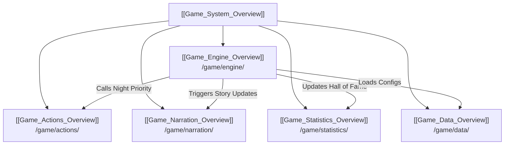

# Game Subsystem Architecture Overview

The `/game` directory contains the core domain model and business logic of the Mafia bot. It models players, manages role definitions and dynamic setup generation, resolves night actions, drives story narration, and coordinates with the game engine state machine.

## 🧭 Navigation
- **Parent Hub**: [[Root_Project_Overview]]
- **Sub-Modules**:
  - [[Game_Engine_Overview]] (`/game/engine/`)
  - [[Game_Actions_Overview]] (`/game/actions/`)
  - [[Game_Data_Overview]] (`/game/data/`)
  - [[Game_Narration_Overview]] (`/game/narration/`)
  - [[Game_Statistics_Overview]] (`/game/statistics/`)
- **Connected Systems**: [[Game_Cogs_Overview]], [[Admin_Cogs_Overview]], [[Game_Setup_Data_Overview]], [[Narration_Data_Overview]]
- **Requirements Reference**: [[HIGH_LEVEL_REQUIREMENTS#Table-4-Daytime-Phase--Voting-System]], [[DETAILED_REQUIREMENTS#1-Core-Game-Loop--State-Machine]]

---

## 🏗️ Core Game Subsystems

---

## 📄 Root Game Files

| File | Purpose | Key Classes / Functions |
| :--- | :--- | :--- |
| `player.py` | Represents an individual game participant. Tracks user ID, role, alignment, living status, votes, and night actions. | `Player` class |
| `roles.py` | Role definitions and dynamic thematic skinning system (`role.name` canonical mechanical identity vs. `role.display_name` themed skin). Loads skins from `data/game_setup/theme_roles.json`. | `GameRole`, `get_role_instance()`, `apply_theme()` |
| `setup_generator.py` | Dynamically balances setups based on participant count using rules in `mafia_setups.json`. | `generate_roles()` |
| `narration.py` | High-level narration dispatcher coordinating static templates vs. generative AI storytellers with theme forwarding. | `NarrationManager` |
| `narration_ai.py` | Google Gemini API integration generating thematic stories across 9 themes with theme-specific Fog of War, Living Player rubrics, and non-death safety constraints for Rom Com and Office Restructuring. | `generate_story()`, `_construct_ai_prompt()` |
| `narration_static.py` | Template-based fallback narration supporting all 9 themes, including dedicated non-death breakup/layoff flavor text for Rom Com and Office Restructuring. | `generate_story()`, `_generate_static_story_part()` |

---

## 🔗 Connected Overviews
- [[Root_Project_Overview]]: Return to Master Hub
- [[Game_Engine_Overview]]: Deep dive into the state machine and game loops
- [[Game_Actions_Overview]]: Resolution logic for night kills, heals, roleblocks, and investigations
- [[Game_Setup_Data_Overview]]: Game configuration files defining role setups
