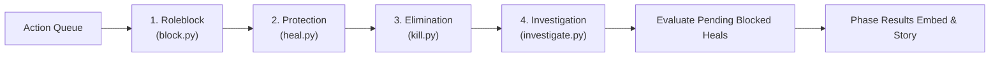

# Game Actions Subsystem Overview

The `/game/actions` directory contains the execution handlers for secret abilities submitted by power roles during the Night phase. These actions are evaluated by the engine in strict priority order.

## 🧭 Navigation
- **Parent Subsystem**: [[Game_System_Overview]]
- **Related Modules**: [[Game_Engine_Overview]], [[Game_Cogs_Overview]]
- **Requirements Reference**: [[HIGH_LEVEL_REQUIREMENTS#Table-5-Nighttime-Phase--Role-Actions]], [[DETAILED_REQUIREMENTS#FR-ACT-02-Roleblock-Execution]]

---

## 📄 Action Handlers

| Priority Tier | File | Handler Function | Canonical Roles | Execution Logic |
| :--- | :--- | :--- | :--- | :--- |
| **Tier 1 (Block)** | `block.py` | `handle_block` | Town / Mob Roleblocker | Neutralizes the target's night action before it can execute. Resolves with dependency ordering and cycle detection. |
| **Tier 2 (Heal)** | `heal.py` | `handle_heal` | Town Doctor / Medic | Grants lethal protection to the target. If target is attacked by an unblocked kill, the attack is thwarted. Consecutive self-heals are forbidden. |
| **Tier 3 (Kill)** | `kill.py` | `handle_kill` | Godfather / Goon / SK | Attempts a lethal strike against the chosen target. Checks whether the target is protected by a Doctor or possesses night immunity. |
| **Tier 4 (Investigate)** | `investigate.py` | `handle_investigation` | Town Cop / Detective | Queries the target's alignment in DMs. Godfather and immune roles return innocent results. |

---

## 🛡️ Roleblock Resolution & Selective Narration Rules

Roleblock actions are resolved at **Priority 1** with rigorous dependency ordering:
1. **Dependency Ordering**: Blockers targeted by 0 other unblocked blockers resolve first. If Blocker A blocks Blocker B, Blocker B's queued block is cancelled and cannot affect Blocker B's target.
2. **Mutual Blocks & Cycles**: If Blocker A blocks Blocker B and Blocker B blocks Blocker A (or a longer cycle occurs), all participants are mutually blocked.
3. **Selective Narration Matrix**:
   - **Investigation Blocked**: ❌ **NEVER shown**. Blocked investigators receive no result in private DMs, but zero public narration or summary lines are generated.
   - **Kill Blocked**: ✅ **ALWAYS shown**. Narrates that an attempted murder was thwarted in the shadows without leaking player names or roles.
   - **Block Blocked**: ✅ **ALWAYS shown**. Narrates that an attempt to interfere with another citizen was thwarted.
   - **Heal Blocked**: ⚠️ **CONDITIONAL**. Only announced if the Doctor's patient was targeted by an active (unblocked) kill attempt that the heal would have prevented. If the patient was not attacked (or the killer was also blocked), the event remains completely silent.
   - **Idle / Plain Townie Blocked**: ❌ **NEVER shown**. Internal state records the block, but no story event is emitted.

---

## 🔄 Night Action Priority Order

---

## 🔗 Connected Overviews
- [[Game_System_Overview]]: Return to Game System Index
- [[Game_Engine_Overview]]: See how `game/engine/night.py` orchestrates these action handlers
- [[Game_Cogs_Overview]]: See how players queue actions via `/kill`, `/heal`, `/investigate`, `/block`
