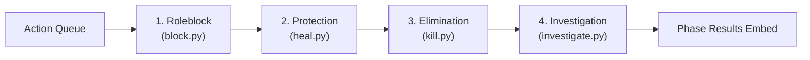

# Game Actions Subsystem Overview

The `/game/actions` directory contains the execution handlers for secret abilities submitted by power roles during the Night phase. These actions are evaluated by the engine in strict priority order.

## 🧭 Navigation
- **Parent Subsystem**: [[Game_System_Overview]]
- **Related Modules**: [[Game_Engine_Overview]], [[Game_Cogs_Overview]]
- **Requirements Reference**: [[HIGH_LEVEL_REQUIREMENTS#Table-5-Nighttime-Phase--Role-Actions]], [[DETAILED_REQUIREMENTS#FR-ACT-02-Roleblock-Execution]]

---

## 📄 Action Handlers

| Priority Tier | File | Action | Allowed Roles | Execution Logic |
| :--- | :--- | :--- | :--- | :--- |
| **Tier 1 (Block)** | `block.py` | `execute_block` | Hooker / Roleblocker | Neutralizes the target's night action before it can execute. Prevents kills, heals, or investigations. |
| **Tier 2 (Heal)** | `heal.py` | `execute_heal` | Doctor / Medic | Grants lethal protection to the target. If target is attacked by Mafia, the kill is thwarted. |
| **Tier 3 (Kill)** | `kill.py` | `execute_kill` | Godfather / Mob Goon | Attempts a lethal strike against the chosen target. Checks whether the target is protected by a Doctor. |
| **Tier 4 (Investigate)** | `investigate.py` | `execute_investigate` | Detective / Cop | Queries the target's alignment. Godfather returns "Town" (innocent) to investigations. |

---

## 🔄 Night Action Priority Order

---

## 🔗 Connected Overviews
- [[Game_System_Overview]]: Return to Game System Index
- [[Game_Engine_Overview]]: See how `game/engine/night.py` orchestrates these action handlers
- [[Game_Cogs_Overview]]: See how players queue actions via `/kill`, `/heal`, `/investigate`, `/block`
