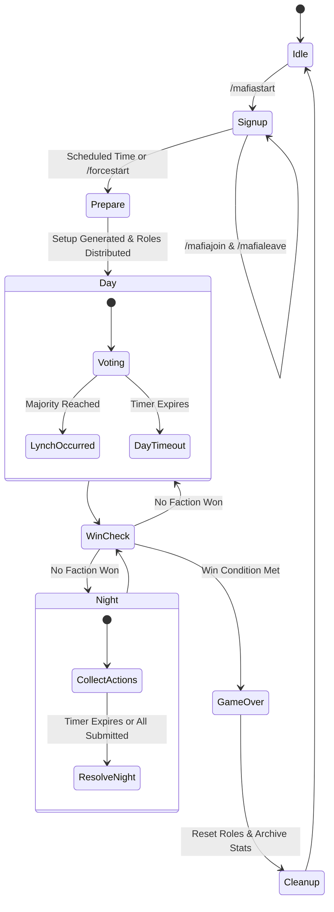

# Game Engine Subsystem Overview

The `/game/engine` directory is the core state machine of the IC Mafia Bot. It governs the game lifecycle, phase transitions, background timer loops, voting tallies, win condition verifications, and state persistence.

## 🧭 Navigation
- **Parent Subsystem**: [[Game_System_Overview]]
- **Related Modules**: [[Game_Actions_Overview]], [[Game_Narration_Overview]], [[Admin_Cogs_Overview]], [[Game_Cogs_Overview]]
- **Requirements Reference**: [[HIGH_LEVEL_REQUIREMENTS#2-System-Architecture--High-Level-Flow]], [[DETAILED_REQUIREMENTS#1-Core-Game-Loop--State-Machine]]

---

## 📄 File Index

| File | Lifecycle Phase / Component | Purpose & Responsibilities |
| :--- | :--- | :--- |
| `initialise.py` | Initialization | Instantiates the `Game` class, establishes channel bindings, phase variables, and player maps. |
| `signup.py` | Registration Phase | Adds/removes players during signups, enforces player capacity, and manages Discord roles. |
| `prepare.py` | Game Preparation | Balances role distribution using setups, generates NPC filler bots, and dispatches role DMs. |
| `start.py` | Phase Kickoff | Launches Day 1 or Night 1, posts initial announcement embeds, renders prominent `DAY PHASE SKIPPED` notices if configured, and starts phase timers. |
| `loop.py` | Background Engine Loop | Asynchronous timer loop monitoring countdowns and triggering phase transitions. |
| `voting.py` | Day Phase (Lynch) | Manages voter rosters, computes dynamic majorities, executes automated NPC day votes via `process_npc_votes()`, executes lynches, and handles ties. |
| `night.py` | Night Phase (Actions) | Collects night actions, executes automated NPC actions, handles Priority 1 block dependency ordering & mutual cycles, resolves remaining tiers, evaluates pending blocked heals post-kills, and promotes Godfathers. |
| `win.py` | Win Evaluation | Checks victory conditions at every phase transition (Town parity, Mafia dominance, Solo wins). |
| `status.py` | Status Generator | Builds real-time game status embeds with alive/dead rosters, countdown clocks, and explicit Day Phase Skip visibility. |
| `reset.py` | Game Cleanup | Strips Discord living/dead roles, clears memory state, and archives game summaries. |
| `persistence.py` | State Persistence | Saves active game state to JSON for crash resilience and reinitialization. |

---

## 🔄 State Machine Transition Diagram

---

## 🔗 Connected Overviews
- [[Game_System_Overview]]: Return to Game System Index
- [[Game_Actions_Overview]]: Detailed handlers for night actions resolved in `night.py`
- [[Game_Narration_Overview]]: Story generation triggered at phase boundaries
- [[Admin_Cogs_Overview]]: Commands controlling this engine
