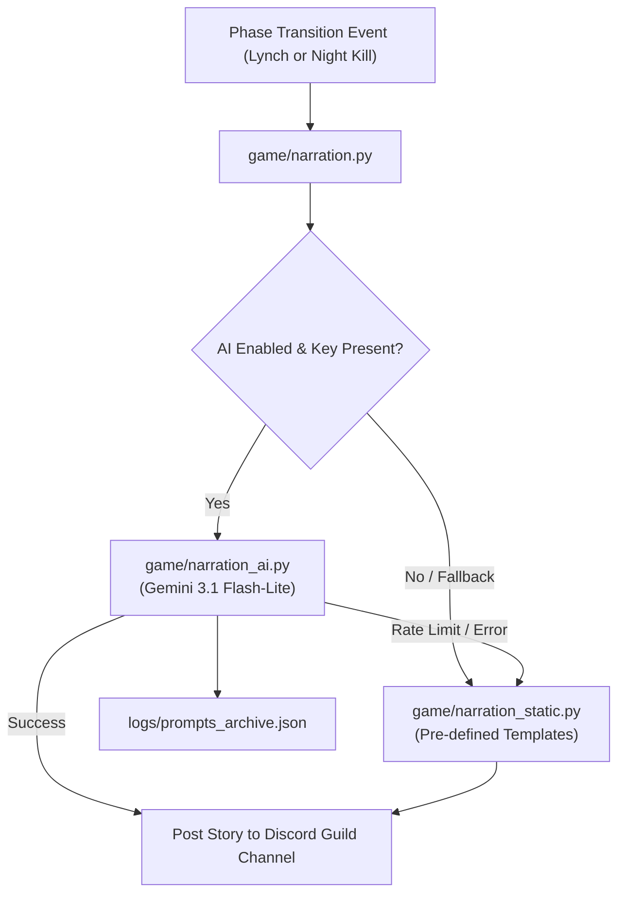

# Game Narration Subsystem Directory Overview

The `/game/narration` directory is dedicated to the narration and storytelling subsystem, housing modular story templates, prompt engineers, and AI narrative connectors.

## 🧭 Navigation
- **Parent Subsystem**: [[Game_System_Overview]]
- **Related Modules**: [[Narration_Data_Overview]], [[Logs_Directory_Overview]]
- **Requirements Reference**: [[HIGH_LEVEL_REQUIREMENTS#Table-6-Narration--Storytelling-System]], [[DETAILED_REQUIREMENTS#FR-NAR-01-Dual-Mode-Narration-Architecture]]

---

## 📖 Subsystem Structure & Architecture

The narration system supports **Dual-Mode Narration**:
1. **Generative AI Narration (`game/narration_ai.py`)**: Uses Google Gemini API to craft narrative stories incorporating player names, roles, quirks, chosen themes (Western, Cyberpunk, Gothic, Noir), and recent phase events.
2. **Deterministic Static Narration (`game/narration_static.py`)**: Built-in template fallback guaranteeing continuous storytelling even during API timeouts or offline play.

---

## 🔗 Connected Overviews
- [[Game_System_Overview]]: Return to Game System Index
- [[Narration_Data_Overview]]: Narrative themes and flavor profiles in `/data/narration`
- [[Logs_Directory_Overview]]: Archives of AI prompt requests and outputs
