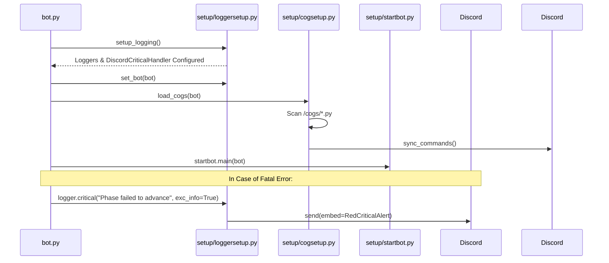

# Bot Setup Subsystem Overview

The `/setup` directory contains the foundational initialization modules for starting the bot, configuring multi-stream logging, and dynamically discovering and registering slash command cogs.

## 🧭 Navigation
- **Parent Hub**: [[Root_Project_Overview]]
- **Related Modules**: [[Logs_Directory_Overview]], [[Cogs_Overview]], [[Utilities_Overview]]
- **Requirements Reference**: [[HIGH_LEVEL_REQUIREMENTS]], [[DETAILED_REQUIREMENTS]]

---

## 📄 File Index

| File | Purpose | Key Functions / Classes |
| :--- | :--- | :--- |
| `startbot.py` | Orchestrates bot startup sequence, environment validation, and main process loop. | `main()`, signal handlers |
| `loggersetup.py` | Configures console output, file rotators for debug/error streams, and Discord mod channel critical alert handler. | `setup_logging()`, `set_bot()`, `DiscordCriticalHandler` |
| `cogsetup.py` | Dynamically scans `/cogs` directory, loads cog extensions into `commands.Bot`, and syncs application commands. | `load_cogs(bot)` |

---

## 🛡️ Logging Hierarchy & Critical Discord Alerting

The bot enforces strict logging severity semantics:
- **DEBUG**: Used for system processes and high-frequency/repeated events (e.g. iterating over all guild members during server-wide role synchronization, phase reminder countdown checks, survival metric math).
- **INFO**: Used for tracking process milestones (bot startup, game initiation, admin command invocations, role shuffle, phase transitions, story publications).
- **WARNING & ERROR**: Used when non-fatal or recoverable issues occur (e.g. invalid command targets, wrong phase action submissions, missing Discord permissions for a specific member).
- **CRITICAL**: Reserved strictly for game-breaking failures (e.g. phase failing to advance in `game_loop_iteration`, role generation abortion, unhandled fatal exceptions).

### `DiscordCriticalHandler`
When any logger calls `logger.critical(...)`:
1. `DiscordCriticalHandler` intercepts the log record at `levelno >= logging.CRITICAL`.
2. Formats a red Discord embed displaying the error description, module, file/line location, function name, and formatted traceback (if `exc_info=True`).
3. Dispatches the embed directly to the administrative mod channel (`config.MOD_CHANNEL_ID`).
4. Rate-limits repeated identical critical error messages within a 30-second cooldown window to prevent Discord API spam during recurring loop errors.

---

## 🔄 Interaction Flow

---

## 🔗 Connected Overviews
- [[Root_Project_Overview]]: Return to Master Hub
- [[Cogs_Overview]]: Learn how loaded cogs handle slash commands
- [[Logs_Directory_Overview]]: See where `loggersetup.py` routes output files
