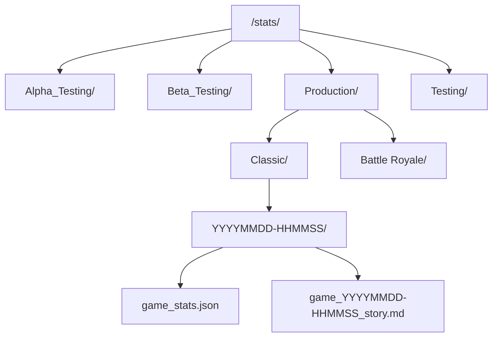

# Stats Storage Subsystem Overview

The `/stats` directory serves as the local database of historical game logs, player records, and narrative story archives generated by the bot upon game completion.

## 🧭 Navigation
- **Parent Hub**: [[Root_Project_Overview]]
- **Related Modules**: [[Export_Cogs_Overview]], [[Stats_Cogs_Overview]], [[Website_Portal_Overview]]
- **Requirements Reference**: [[HIGH_LEVEL_REQUIREMENTS#Table-8-Statistics-Tracking--Analytics]], [[DETAILED_REQUIREMENTS#FR-STA-01-Player-Career-Profile]]

---

## 📁 Directory Structure

---

## 📄 Root Utilities in `/stats`

| File | Purpose |
| :--- | :--- |
| `analysegames.py` | Aggregates all JSON match records across game types to calculate global win rates, faction balances, and phase length metrics. |
| `statshelper.py` | Helper functions for reading, sanitizing, and indexing game stats files. |

---

## 🔗 Connected Overviews
- [[Root_Project_Overview]]: Return to Master Hub
- [[Export_Cogs_Overview]]: Module that uploads these stats to Google Sheets
- [[Website_Portal_Overview]]: Web portal visualizing these records
